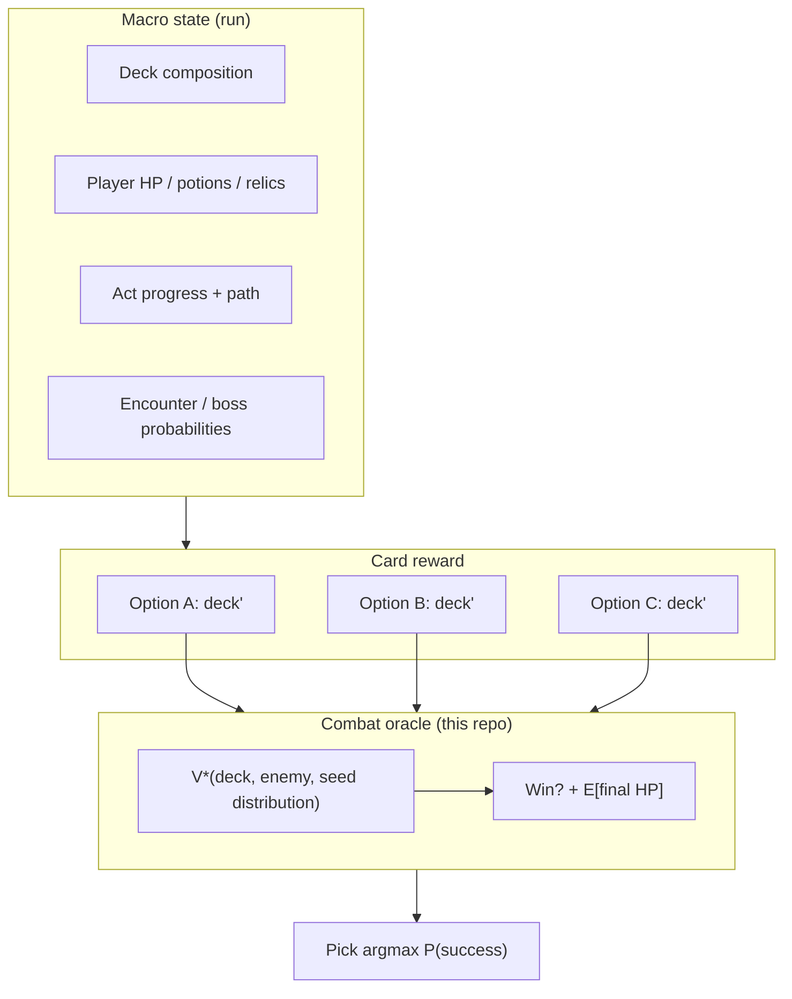

# Combat sim — vision, design, and roadmap

Mathematical combat solver for *Slay the Spire 2* (Ironclad-first). This document captures **why** the sim exists, **what** to preserve as we add complexity, and **where** it connects to the wider agent—not only file layout and APIs.

**Code:** `combat_sim/`  
**Tests:** `tests/test_combat_sim.py`, `tests/test_optimal_solver.py`, `tests/test_tuple_dp.py`, `tests/test_sim1.py`, …

---

## Why this exists

The live agent (`sts2_agent/`) learns from play and heuristics. Combat itself is different: most quantities are **fixed and known**—card costs, damage, block, enemy intent patterns, deck composition, shuffle rules. Uncertainty is **structured**, not opaque:

| Source of uncertainty | How we treat it |
|----------------------|-----------------|
| Opening hand (5 cards from deck) | Exact enumeration or known combinatorics |
| Draw order after plays | Deterministic given `shuffle_seed` + shuffle count |
| Future generated cards | Trackable if generation pool and rules are modeled |

So the right tool for combat is **exact or expectation-optimal search**, not a neural net guessing at Strike math. Monte Carlo remains useful as a **sanity check**, not as the primary decision engine.

**Win condition:** enemy HP reaches 0.  
**Objective (lexicographic):** win ≻ maximize final player HP ≻ fewer turns to win.

That ordering is a design commitment: a line that wins with 77 HP in 4 turns beats a line that wins with 73 HP in 2 turns.

---

## Design principles (document these, not only the code)

### 1. Perfect information given the seed

A fight with a fixed `shuffle_seed` is a **finite game**. The solver should never “guess” when it can enumerate. Randomness is modeled as **known distributions** (opening hands, draw order), not noise in the optimizer.

### 2. One rules engine, one value function

`CombatEngine` (Sim 0+) and tuple DP transitions must agree on:

- energy and legal plays per turn  
- play order when it matters (Sim 1: block → Bash → Strikes)  
- enemy intent cycle  
- vuln/weak timing (e.g. vuln −1 at **start of player turn**, after enemy acted)  
- shuffle canonicalization (`combat_sim/shuffle.py`)

If engine and DP disagree, the solver will look “wrong” while the sim “works”—always treat that as a **bug**, not a tuning knob.

### 3. Policy search memo must not lie

#### The bug (formal)

The memo stored a **context-dependent** entry as if it were universal:

\[
\text{Memo}[s] = (\texttt{DpValue(LOSS\_HP)}, \texttt{None})
\]

When state \(s\) was first visited as a **subproblem** under a high \(V^\*\) bound, the **HP ceiling prune** wrote that lossy entry. On a second visit from the real policy search:

\[
\text{memo hit} \rightarrow \texttt{best\_comp} = \texttt{None} \rightarrow (0,0,0) \rightarrow \text{End Turn}
\]

This violated: *a memo entry must be valid for all future visits to that state, not only the context in which it was first written.*

**Verified impact (seed 42, Jaw Worm Sim 1):**

| Metric | Buggy | Fixed |
|--------|-------|-------|
| Turn 1 play | 1 Bash | 1 Defend + 1 Bash |
| Final HP | 55 | 72 |
| Turns | 15 | 4 |
| HP loss vs fix | — | 17 (Turn 4 End Turn + unnecessary hit) |

#### The fix

1. **Removed** caching of ceiling prunes (Sim 0 and Sim 1).  
2. **Re-enabled** ceiling prune as *branch cut only*: if \(hp_{\text{ceiling}}(s) \le V^\*\), return loss **without** `memo[key] = …`.  
3. **Kept** survival/kill prunes cached (absolute — state is losing/unwinnable regardless of \(V^\*\)).

| Prune type | Safe to cache? | Why |
|------------|----------------|-----|
| Survival | Yes | Only if pessimistic HP bound fails **and** `hp_e > max_kill` (cannot finish in time) |
| Kill | Yes | Cannot kill enemy in time |
| HP ceiling | **No** | Depends on \(V^\*\), which changes as search progresses |

```python
# Prune without caching
if hp_ceiling(s) <= best_known:
    return DpValue(LOSS_HP), None  # do NOT memo[key] = this
```

- Candidates and chosen play must use the **same** recursion (`_child_value` / `_solve_core`) and shared `best_known`.

#### Survival prune must not ignore a kill race (Sim 1–3, May 2026)

**Symptom:** Turn 6 vs Bygone Effigy (seed 42): candidates showed `1 Defend + 1 Bash: WIN at 45 HP`, but policy chose End Turn.

**Cause:** `_apply_forward_prunes` returned `survival` when `hp_p - damage_min_survival <= 0`, cached `(LOSS, End Turn)` at the **root**, and never enumerated plays. `_child_value` for candidates still descended into children (no survival check on the parent), so listing and policy disagreed.

**Not** the ceiling-prune memo bug — ceiling prune was already not cached. The pessimistic survival bound (every future attack at 23 minus one turn of block) ignored that the enemy could be killed in a few turns.

**Fix:**

```python
max_kill = _damage_max_kill(st, params.max_turns)
if hp_p - damage_min_survival(st, params) <= 0 and hp_e > max_kill:
    return "survival"
```

After this fix, Effigy seed 42 is **winnable** (optimal line reaches ~47 HP).

### 4. Incremental sim versions, not one big bang

| Version | Deck | Mechanics | Status |
|---------|------|-----------|--------|
| **Sim 0** | 5 Strike + 4 Defend | Damage, block, intents | Stable |
| **Sim 1** | + 1 Bash | Vulnerable, Bash | Stable (Jaw Worm) |
| **Sim 2** | + 1 Bloodletting (11 cards) | Dynamic energy, self-damage | Stable (Jaw Worm) |
| **Sim 3** | + 1 Inflame (12 cards) | Permanent Strength, exhaust power | Stable (Jaw Worm) |
| **Sim N** | Growing | Weak, draw, generate, … | Planned |

Each version should have scenarios, tuple DP (or equivalent), tests, and CLI before the next mechanic lands.

### 5. Explainability over opaque scores

Logged fights print **candidate lines** with projected final HP and turns. That is intentional: humans (and future agents) should see *why* a line was picked. If top candidates tie on HP, tie-break rules must be documented and stable.

---

## What we optimize in combat

At each decision point the solver sees:

- player HP, block, energy  
- hand composition (counts or full order when needed)  
- draw pile + discard + shuffle count (deterministic continuation)  
- enemy HP, block, debuff stacks, pattern index  
- incoming intent this turn  

It chooses a **turn composition** (how many Strikes / Defends / Bash to play, subject to energy and hand) to maximize the lexicographic value above.

**Opening expectation** (Sim 1): exact over all \(\binom{10}{5}\) opening hands—\(E[\text{final HP}]\) and win rate before any card is played. That is the template for “odds-aware” reasoning later.

---

## Technical map (short)

```
combat_sim/
  engine.py          # Authoritative step-by-step rules
  state.py           # CombatState, enemies, intents
  cards.py           # Card definitions per sim version
  shuffle.py         # canonical_shuffle(pile, seed, count)
  tuple_dp.py        # Sim 0 exhaustive DP
  optimal_solver.py  # Bridge engine ↔ Sim 0 DP
  bounds.py          # Admissible pruning (Sim 0)
  runner.py          # Logged fights, batch reports
  scenarios.py       # jaw_worm, jaw_worm_sim2, bygone_effigy_sim2, …
  sim1/
    tuple_dp.py      # Sim 1 DP + apply_turn_sim1
    composition.py   # (strikes, defends, bash) feasibility
    optimal.py       # choose_optimal_turn_sim1
    opening.py       # C(10,5) opening expectation
  sim2/
    tuple_dp.py      # Sim 2 DP + Bloodletting
    composition.py   # (s, d, b, bl) with s+d+2b <= 3+2*bl
    optimal.py       # choose_optimal_turn_sim2
    opening.py       # C(11,5) opening expectation
  sim3/
    tuple_dp.py      # Sim 3 DP + Inflame + strength_p
    composition.py   # (s, d, b, bl, inf) with s+d+2b+inf <= 3+2*bl
    optimal.py       # choose_optimal_turn_sim3
    opening.py       # C(12,5) opening expectation
```

**CLI examples:**

```powershell
py -m combat_sim --scenario jaw_worm --seed 42
py -m combat_sim --sim 1 --scenario jaw_worm_sim1 --seed 42
py -m combat_sim --sim 2 --scenario jaw_worm_sim2 --seed 42
py -m combat_sim --sim 2 --scenario bygone_effigy_sim2 --seed 42
py -m combat_sim --sim 3 --scenario jaw_worm_sim3 --seed 42
py -m combat_sim --sim 3 --scenario bygone_effigy_sim3 --batch 20 --base-seed 0
py -m combat_sim --sim 1 --opening-expectation --scenario jaw_worm_sim1 --fast
py -m pytest tests/test_sim1.py -v
```

**`seed`:** fixes shuffle sequence; same seed ⇒ same fight trajectory if decisions are fixed.

**Performance (Sim 1 Turn 1, seed 42):**

| Stage | Turn 1 solve |
|-------|----------------|
| Buggy ceiling prune (cached) | ~100s |
| No ceiling prune | ~100s |
| Safe ceiling prune (prune ✓, cache ✗) | ~0.01s |

Safe ceiling prune: cut branches when \(hp_{\text{ceiling}}(s) \le V^\*\), but **never** `memo[key] = …` for that cut.

---

## Landmark — Sim 0 vs Sim 1 batch comparison (May 2026)

**First empirical proof** that the combat oracle can quantify how a deck change affects outcomes across many seeds—not just one logged fight. This is the same machinery future **card-reward** decisions will use: patch the deck, re-run the batch, read \(\Delta\) win rate / \(\Delta\) HP / \(\Delta\) turns.

### Batch results (100 seeds, Jaw Worm, optimal DP)

Reproduce:

```powershell
py -m combat_sim --batch 100 --scenario jaw_worm
py -m combat_sim --batch 100 --sim 1 --scenario jaw_worm_sim1
```

| Metric | Sim 0 (5S+4D) | Sim 1 (+ Bash) | Delta |
|--------|---------------|----------------|-------|
| Win rate | 100% | 100% | = |
| Avg final HP | **78.33** | **75.79** | −2.54 HP |
| Avg turns | **4.94** | **5.51** | +0.57 turns |
| Elapsed (100 seeds) | ~1.1s | ~1.3s | — |

Both decks always win vs Jaw Worm under the solver; the interesting part is **how much** HP and **how many** turns optimal play spends to get there.

**Development notes (same session):** early scratch notes had Sim 0 at 75.97 HP / 8.88 turns and Sim 1 at 4.94 turns—before the ceiling-prune fix and final batch pass. The **4.94** turn average matches Sim 0 in the canonical run above; always re-run the CLI after solver changes. The landmark is the **comparison method**, not a single frozen row of numbers.

### What this proves mathematically

Adding Bash is not “one more card in the pool”—it changes the **combat efficiency surface**:

**Why Bash can shorten fights (structural):**

Without Bash, kills are mostly Strike-limited:

\[
\text{Strikes to kill 40 HP} \ge \left\lceil \frac{40}{6} \right\rceil = 7 \quad \text{(ignoring block / vuln)}
\]

With Bash + Vulnerable, burst damage jumps:

\[
\text{Bash on vuln} = \lfloor 8 \times 1.5 \rfloor = 12
\]

So the **minimum-turn kill frontier** compresses when vuln is applied and chained into Strikes.

**Why fewer turns can mean more HP (cascade):**

\[
\text{fewer player turns} \rightarrow \text{fewer enemy intents resolved} \rightarrow \text{less damage from the cycle (e.g. the 11-damage hit)}
\]

One card can move both **lethal speed** and **survival**—a coupled effect, not two independent stats.

**What the current batch shows:** under the lexicographic objective (win ≻ max final HP ≻ fewer turns), Sim 1’s optimal policy sometimes **uses longer lines** to extract HP (Bash setup, vuln sequencing) while Sim 0’s 9-card deck averages slightly **higher HP in fewer turns** on this enemy. The oracle’s job is to report that honestly; the card-reward layer will pick the deck that maximizes **your** macro utility, not assume “new rare card = strictly better on every metric.”

### The deeper insight (card-reward oracle)

This is the first time we can answer, with numbers:

> *“What is adding Bash worth on this fight distribution?”*

Example quantification from the canonical batch:

\[
\Delta HP_{avg} = 75.79 - 78.33 = -2.54 \text{ HP per fight (Sim 1 vs Sim 0 on Jaw Worm)}
\]
\[
\Delta turns_{avg} = 5.51 - 4.94 = +0.57 \text{ turns per fight}
\]

Sign can flip by enemy, act, and objective weights; the **pipeline** is what matters:

1. Define deck A vs deck B.  
2. Run exact (or expectation) fight oracle over seeds / opening hands.  
3. Report \(\Delta\) win rate, \(\Delta E[\text{HP}]\), \(\Delta\) turns.  
4. At reward time: same step for each of three offered cards vs your upcoming path.

That is the card-reward oracle working as designed—even when the “cool new card” is not strictly dominant on every metric.

---

## Landmark — Three-sim stress test vs Bygone Effigy (May 2026)

**Purpose:** Jaw Worm became a local optimum (100% wins, fast kills). **Bygone Effigy** (Tier A: 127 HP, pattern 0 / 0 / 23) is an unwinnable elite that still separates decks by **how much damage** the oracle deals before death.

**Enemy (Tier A):** Sleep 0 → Empower 0 → Slash 23 (repeat). HP 127. No enemy Strength in sim — see `reference/monsters/bygone_effigy_tier_a.json`.

### Reproduce (20 seeds, `base_seed=0`, `max_turns=30`)

```powershell
py -m combat_sim --sim 0 --scenario bygone_effigy_sim0 --batch 20 --base-seed 0
py -m combat_sim --sim 1 --scenario bygone_effigy_sim1 --batch 20 --base-seed 0
py -m combat_sim --sim 2 --scenario bygone_effigy_sim2 --batch 20 --base-seed 0
```

### Three-sim comparison

| Metric | Sim 0 (5S+4D) | Sim 1 (+ Bash) | Sim 2 (+ BL) | Trend |
|--------|---------------|----------------|--------------|-------|
| Win rate | 0% | 0% | 0% | = |
| Avg turns | 12.00 | 12.00 | 13.65 | ↑ (Sim 2 survives longer) |
| Avg enemy HP left | 127.00 | 127.00 | **67.85** | ↓ |
| Avg enemy % HP left | 100% | 100% | **53.43%** | ↓ |
| Death turn distribution | T12: 100% | T12: 100% | T12: 50%, T15: 50% | spread |

Batch reports also print **Avg enemy HP left** and **Avg enemy % HP left** — use these when win rate is stuck at 0%.

### Headline number

\[
\Delta_{\text{enemy HP dealt}} = 127.00 - 67.85 \approx 59.15 \text{ HP}
\]

\[
\frac{59.15}{127} \approx 46.6\% \text{ of Effigy HP stripped (Sim 2 vs Sim 0/1)}
\]

Bloodletting + Bash together enable a damage profile neither starter deck approaches on this fight.

### Why Sim 0 and Sim 1 are identical

\[
\text{Enemy HP left}_{Sim1} = 127 = \text{Enemy HP left}_{Sim0}
\]

Slash damage is **23 every third turn** (0 / 0 / 23 pattern). Bash costs 2 energy, leaving little room to block and burst. The solver correctly ranks:

\[
\text{Play Defends} \succ \text{Play Bash}
\]

Bash does not provide enough burst to kill before death and wastes energy that could buy block. **Sim 1 effectively plays like Sim 0** on this enemy — the oracle is not “wrong”; Bash has **no value** in the optimal unwinnable line.

### Why Sim 2 is different

Bloodletting: cost 0, +2 energy, −3 HP.

The solver can open with lines like **BL + Bash + Strikes** (up to 5 energy with one BL), e.g.:

- Bash 8 + Strikes with vuln: \(\lfloor 6 \times 1.5 \rfloor = 9\) per Strike after vuln  
- Energy from BL makes Bash **viable** in ways Sim 1 alone cannot on this pattern

The solver trades **player HP** (BL self-damage) for **extra turns and damage** when the fight is already lost — the right trade when death is inevitable.

### Death-turn split (Sim 2)

| Sim | Loss histogram (20 seeds) |
|-----|---------------------------|
| 0 / 1 | Turn 12: 100% |
| 2 | Turn 12: 45%, Turn 15: 55% |

In ~half of seeds, Bloodletting buys **~3 extra turns** before death. Those turns map directly to the ~59 HP of extra enemy damage. Progress shows up in **enemy HP left** and **death turn spread** even at 0% win rate.

### Subset principle (measured)

Prediction: \(V^*_{Sim2} \ge V^*_{Sim1} \ge V^*_{Sim0}\) (better deck → better outcome).

Measured by enemy HP remaining (lower is better):

\[
67.85 \le 127 = 127 \quad \checkmark
\]

Sim 2 **strictly dominates** Sim 0 and Sim 1 on this stress test.

### Quantified card value (this enemy, losing fights)

| Addition | \(\Delta\) enemy HP dealt (127 − avg left) |
|----------|---------------------------------------------|
| Bash alone (Sim 1 vs Sim 0) | **0** |
| Bloodletting deck (Sim 2 vs Sim 0) | **~59 HP** |

Against Bygone Effigy with the starter+BL deck, **Bloodletting’s line** is worth ~59 damage in expectation; **Bash alone** is worth 0 on top of Strike/Defend. That is a concrete oracle output — the same pipeline intended for card rewards.

### What this stress test proves

1. **Unwinnable detection** — solver plays defensively / End Turn when all lines lose; no false wins.  
2. **Subset principle** — better decks produce strictly better partial outcomes.  
3. **Progress without win rate** — enemy HP left and % HP left track improvement when win rate stays 0%.  
4. **Card-value decomposition** — isolate Bash vs Bloodletting contribution per enemy via deck ablation batches.

### Sim 3 addendum — Inflame (+ permanent Strength)

```powershell
py -m combat_sim --sim 3 --scenario bygone_effigy_sim3 --batch 20 --base-seed 0
```

| Metric | Sim 2 (+ BL) | Sim 3 (+ Inflame) |
|--------|--------------|-------------------|
| Win rate | 0% | 0% |
| Avg enemy HP left | 67.85 | **57.05** |
| Avg enemy % HP left | 53.43% | **44.92%** |
| Avg turns | 13.65 | 13.50 |

\[
127 - 57.05 \approx 69.95 \text{ HP dealt (Sim 3)} \quad\text{vs}\quad 59.15 \text{ (Sim 2)}
\]

Early Inflame (+2 permanent Strength) compounds on every future Strike/Bash; the oracle values that over a one-turn Strike on this unwinnable line. Still 0% wins, but **~11 HP** more damage than Sim 2 on the same 20 seeds.

**Mechanics (Sim 3):** `strength_p` on state; damage \(=\lfloor (base + strength_p) \times 1.5 \rfloor\) if vuln, else \(base + strength_p\). Inflame: 1 energy, +2 strength, **exhaust** (removed from all piles). Energy: \(s + d + 2b + inf \le 3 + 2\cdot bl\). Play order: BL → Defend → Inflame → Bash → Strike.

---

## Roadmap — combat depth

Phases are ordered so each step stays testable.

### Phase A — Core combat (done / in progress)

- [x] Sim 0: Strike/Defend, single enemy, cyclic intents  
- [x] Exact tuple DP + opening expectation (Sim 0)  
- [x] Sim 1: Bash + Vulnerable  
- [x] Sim 2: Bloodletting (dynamic energy, hp_loss)  
- [x] Sim 3: Inflame (permanent Strength, exhaust; damage = base + strength, then vuln)  
- [x] Regression: no spurious End Turn; max-HP lines on seed 42  
- [ ] Performance: faster Sim 1 DP (memo per turn, better bounds)  
- [x] Bygone Effigy Tier A (`bygone_effigy_sim2`) — 127 HP, 0/0/23 pattern  
- [ ] More scenarios (block turns, lethal checks)

### Phase B — Mechanics (Ironclad, STS2 rules)

Add one mechanic at a time with engine + DP + tests:

| Mechanic | Solver impact |
|----------|----------------|
| Weak | Damage multiplier on player attacks |
| Frail | Block reduction |
| Card draw | Branch or distribution over draw outcomes |
| Card generation | Pool + count in state; branch or expectation |
| Exhaust, retain, innate | Pile / hand invariants |
| Powers (e.g. Demon Form) | Extra state dimensions per combat |
| Multi-enemy | Targeting + joint intent |

Stop when **Ironclad combat** matches STS2 rules for cards we care about—not when every character exists.

### Phase C — Enemy pool

- Enemies with scaling HP/damage  
- Debuff applicators (Frail, Vulnerable on player, etc.)  
- Multi-hit attacks, buff intents, minions  

Each enemy is a **scenario module**: pattern tuple + starting stats + tests that lock intent math.

### Phase D — Verification layer

- MC solver (`math_solver.py`) samples randomness for cross-check  
- Property tests: engine path vs DP path same outcome  
- Golden logs: seed + scenario ⇒ expected final HP

---

## Roadmap — beyond combat (card rewards and run odds)

This is the **long-term product direction** you described; combat sim is the **oracle** inside it.

### The question at a card reward screen

> Given my current deck, HP, act position, boss, and remaining encounter mix, which of these three cards maximizes my probability of beating the act (or the run)?

That decomposes naturally:



**Feasibility:** yes, in stages—it is the same class of problem as classic STS AI research (combat sim + deck valuation), not magic and not impossible.

| Piece | Difficulty | Notes |
|-------|------------|--------|
| Single-fight optimal play | Medium | Done for simple decks; grows with mechanics |
| Fight win% vs one enemy | Medium | Opening expectation + seed averaging, or DP over draw |
| Sequence of fights in an act | Hard | State = deck + HP; transitions from combat oracle |
| Card reward (3 choices) | Hard but structured | Compare 3 deck patches via downstream value |
| Full run path + shop + events | Very hard | Still can approximate with staged rollouts |

**What makes it tractable**

- Combat is **short** and **repeatable**—good for caching \(V^*\) per (deck signature, enemy, seed band).  
- Deck changes are **low-dimensional** at reward time (one card added).  
- Encounter pools per act are **finite**—odds are a table, not a black box.

**What makes it hard**

- State explosion as mechanics stack (powers, relics, multiple enemies).  
- Card **generation** and **transform** effects widen the belief state.  
- “Correct” macro objective (beat boss vs greedy floor) needs explicit utility.  
- Compute: must cache aggressively and possibly use bounded-depth act simulation first.

**Recommended strategy**

1. **Perfect combat oracle** for a fixed deck vs fixed enemy (this project).  
2. **Deck-valued fight:** \(E[\text{HP after fight}]\) over opening hands / shuffle seeds.  
3. **Act slice:** weighted sum over a small encounter mix (e.g. 70% hallway, 20% elite, 10% boss).  
4. **Card reward:** score each option by Δ act success probability; only then add shops/events.

Do **not** jump to full-run RL until step 1–3 are trustworthy—otherwise the agent optimizes a wrong combat model.

---

## Relationship to the main agent

| Layer | Role |
|-------|------|
| **`combat_sim/`** | Ground-truth math for fights; tests; human-readable logs |
| **`sts2_agent/`** | Live play via MCP; heuristics + BC/PPO today |
| **Future** | Agent calls combat oracle (or precomputed tables) for rewards, not raw intuition |

[PPO + Qwen roadmap](QWEN_PPO_ROADMAP.md) stays valid for **exploration and language**; combat sim is the **calculator** that keeps strategy honest when numbers matter.

---

## Opinion: does the full vision make sense?

**Yes.** Starting with deterministic combat and known odds is the right foundation. STS-like games are deliberately built so fights are puzzles with measurable outcomes; card rewards and pathing are “which puzzle setup do I want for the next hour?”

**It is not too complex** if you refuse to skip layers: each mechanic and enemy must be correct in isolation before macro decisions trust the oracle. The risk is not mathematics—it is **scope creep** (every relic, every event, every character at once).

**Feasible milestones that prove value early**

1. Jaw Worm + full starter: optimal line matches intuition (done for Sim 1 seed 42).  
2. Opening-hand \(E[\text{HP}]\) published for Sim 0/1.  
3. Card reward on **one** act-1 choice: “add Strike vs add Defend” with 3-fight remainder—compare oracle scores.  
4. Only then wire into `sts2_agent` card-reward handler as an optional `--oracle` mode.

That path gives you a **checkable** agent story: “I picked this card because it raised act-1 win rate by X%,” not because the policy net liked the embedding.

---

## Invariants checklist (when adding mechanics)

Before merging a new sim version, confirm:

- [ ] Engine and DP agree on a golden turn sequence  
- [ ] Debuff/decay timing matches STS2 (document the rule in PR)  
- [ ] End Turn is never chosen when a strictly better or equal-HP winning play exists  
- [ ] Candidate list and chosen play use the same solver core  
- [ ] At least one scenario test + one regression seed  
- [ ] Logged fight shows candidates with final HP and turns  

**Automated regressions (`tests/test_sim1.py`):**

| Test | Locks |
|------|--------|
| `test_turn1_seed42_picks_max_hp_line` | Max-HP opening line (not 1 Bash @ 73 HP) |
| `test_turn4_seed42_no_spurious_end_turn` | Turn 4 memo/prune — no End Turn when plays win |
| `test_sim1_jaw_worm_batch_100_seeds_all_win` | 100/100 wins vs Jaw Worm Sim 1 |

**Note:** `solve_optimal` defaults `shuffle_seed=0` for draw continuation; fight `seed=42` only fixes deck order. Do not assert HP from seed 42 against `shuffle_seed=0` (see `test_dp_beats_greedy_shape_on_jaw_worm`).

---

## Changelog

| Date | Note |
|------|------|
| 2026-05-19 | Initial vision doc; Sim 0/1 status; memo/prune lesson; macro roadmap |
| 2026-05-19 | Formal ceiling-prune bug write-up; safe prune-without-cache in Sim 0/1 |
| 2026-05-19 | Turn 4 + batch-100 regressions; shuffle_seed test fix |
| 2026-05-19 | Landmark: first Sim 0 vs Sim 1 batch oracle comparison (Jaw Worm × 100 seeds) |
| 2026-05-19 | Bygone Effigy Tier A; batch enemy HP metrics; three-sim stress test doc |
| 2026-05-19 | Sim 3: Inflame + permanent Strength; `bygone_effigy_sim3` scenario |
| 2026-05-19 | Fix unsound survival prune (must also fail kill bound); Effigy seed 42 wins |
