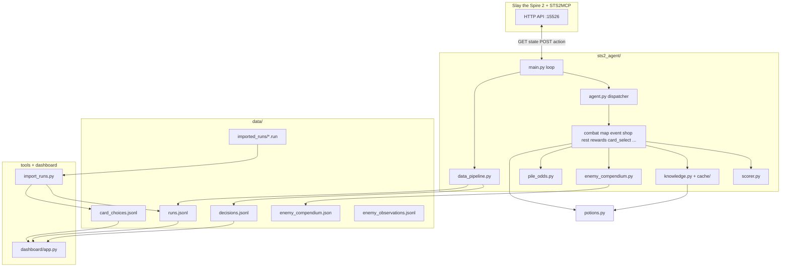

# STS2 Problem Solver - developer notes

Reference for layout, APIs, and where to change behavior. Use the TOC to jump around.

---

## Table of contents

1. [What this project is](#1-what-this-project-is)
2. [Big picture architecture](#2-big-picture-architecture)
3. [How to run things](#3-how-to-run-things)
4. [The game API contract](#4-the-game-api-contract)
5. [Main loop (`main.py`)](#5-main-loop-mainpy)
6. [Dispatcher (`agent.py`)](#6-dispatcher-agentpy)
7. [State parsing (`state_parse.py`)](#7-state-parsing-state_parsepy)
8. [Handlers (decision logic)](#8-handlers-decision-logic)
9. [Scoring (`scorer.py`)](#9-scoring-scorerpy)
10. [Knowledge base (`knowledge.py`)](#10-knowledge-base-knowledgepy)
11. [Enemy compendium (learned patterns)](#11-enemy-compendium-learned-patterns)
12. [Training data (`data_pipeline.py`)](#12-training-data-data_pipelinepy)
13. [Human run import (`tools/import_runs.py`)](#13-human-run-import-toolsimport_runspy)
14. [Dashboard (`dashboard/app.py`)](#14-dashboard-dashboardapppy)
15. [Supporting modules](#15-supporting-modules)
16. [Data files](#16-data-files)
17. [Design patterns used everywhere](#17-design-patterns-used-everywhere)
18. [Known limitations](#18-known-limitations)
19. [Where to extend next](#19-where-to-extend-next)

---

## 1. What this project is

Rule-based (and optional learned-policy) bot for *Slay the Spire 2* via **STS2MCP** at `http://127.0.0.1:15526` - poll state JSON, POST actions JSON.

| Piece | Role |
|------|------|
| `sts2_agent/` | Poll loop, handlers, scoring |
| `data/*.jsonl` | Runs + per-step decisions |
| `training/` | BC / PPO on logged decisions |
| `dashboard/` | Streamlit stats |
| `tools/import_runs.py` | Human `.run` files into `runs.jsonl` |

Default play uses `scorer.py` and Spire Codex card/relic data. `--policy` loads `models/*.pt`.

---

## 2. Big picture architecture



**One tick of the main loop:**

1. `GET /api/v1/singleplayer` → full game `state` dict  
2. `observe_state(state)` → detect run start/end, update combat HP tracking  
3. If menu/game over → `MenuFlow` picks character / restarts run  
4. Else → `decide(state)` → handler returns `{ "action": "...", ... }`  
5. Dedup check (don’t spam same action on unchanged state)  
6. `POST` same endpoint with action JSON  
7. `record_training` → append to `decisions.jsonl` if successful  

---

## 3. How to run things

### Prerequisites

- Slay the Spire 2 running with **STS2MCP** enabled  
- Python 3.10+  
- `pip install -r requirements.txt`

### Agent (plays the game)

```powershell
cd C:\Users\migue\Documents\CursorRepo\STS2ProblemSolver
py -m sts2_agent.main
```

Useful flags:

| Flag | Meaning |
|------|---------|
| `--character ironclad` | Character id for new runs |
| `--interval 0.5` | Seconds between polls |
| `--refresh-knowledge` | Re-download Codex cache (cards, relics, monsters, encounters, **potions**) |
| `--no-compendium` | Record enemy intents for training, but **do not** use learned patterns in combat decisions |
| `-v` | Debug logging |

**Training-focused runs** (let a future model learn patterns from data, not the rule bot):

```powershell
py -m sts2_agent.main --no-compendium
```

With `--no-compendium`, combat uses **live API intents only** for block/damage decisions; `enemy_compendium.json`, `enemy_observations.jsonl`, and `intent_history` in `decisions.jsonl` still update every fight.

**Graceful shutdown:**

- **Ctrl+C** - stop immediately  
- **Ctrl+Break** (Windows) - finish current run, then exit  

### Dashboard (read-only stats)

```powershell
py -m streamlit run dashboard/app.py
```

Use sidebar **Reload data** after imports or long agent sessions.

### Import human `.run` files

Default folder (contributors drop files here):

```powershell
py tools/import_runs.py
```

Custom folder:

```powershell
py tools/import_runs.py --folder "C:\path\to\history"
```

### CLI stats (terminal)

```powershell
py -m sts2_agent.stats
```

---

## 4. The game API contract

The client is `sts2_agent/api.py`:

- `STS2Client.get_state()` → `GET` → JSON state object  
- `STS2Client.send_action(action)` → `POST` with `{"action": "play_card", ...}`  

Every state has at least:

| Field | Meaning |
|-------|---------|
| `state_type` | What screen/mode the game is in (see below) |
| `player` | HP, energy, hand, deck, potions, relics, gold |
| `run` | Floor, act, ascension |
| `battle` | Enemies, turn info (combat only) |

Handlers only work if `state_type` matches what they expect. Wrong handler → no action → loop waits.

### Common `state_type` values

| state_type | Handler module |
|------------|----------------|
| `menu`, `game_over` | `menu.py` (in main loop, not agent) |
| `map` | `map.py` |
| `monster`, `elite`, `boss` | `combat.py` |
| `hand_select` | `combat.py` (in-combat card pick) |
| `card_select` | `card_select.py` |
| `card_reward` | `rewards.py` |
| `rewards` | `rewards.py` |
| `treasure` | `rewards.py` |
| `rest_site` | `rest.py` (+ `card_select` overlay) |
| `shop`, `fake_merchant` | `shop.py` |
| `event` | `event.py` |

---

## 5. Main loop (`main.py`)

**Job:** Connect to API, poll forever, orchestrate menu vs in-run logic, deduplicate actions, log training data.

### Key functions

| Function | Role |
|----------|------|
| `run()` | Infinite poll loop |
| `_run_in_progress()` | Is the player mid-run? |
| `_record_training_data()` | After successful POST, route log to correct handler |
| `parse_args()` | CLI |

### Menu vs in-run

If `MenuFlow.should_handle(state)` → menu actions (pick character, embark, continue).  
Else → `decide(state)` from `agent.py`.

`MenuFlow` auto-starts new runs after game over so the bot can run overnight.

### Dedup (“stuck” prevention)

```text
fingerprint = hash of important state fields (agent.state_fingerprint)
action_key = fingerprint + action dict
```

If both match last tick → **skip POST** (sleep and poll again).

**Exceptions** (allow repeat POST when game might be stuck):

- Leaving shop with `proceed` but shop still showing  
- Rewards screen `proceed` / `claim_reward`  
- Event dialogue `advance_dialogue`  
- Card select `select_card` / `confirm_selection`  
- `use_potion` (retry different slots)  

---

## 6. Dispatcher (`agent.py`)

**Job:** Single entry point: given full `state`, return `Decision(action, reasons)`.

### Priority order (first match wins)

1. `hand_select` → combat  
2. `card_select` active → `card_select.py`  
3. Combat types → `combat.py`  
4. `map` → `map.py`  
5. `card_reward` → `rewards.py`  
6. `rewards` → `rewards.py`  
7. `treasure` → `rewards.py`  
8. `rest_site` → `rest.py`  
9. `shop` / `fake_merchant` → `shop.py`  
10. `event` → `event.py`  
11. `menu` / `game_over` → no-op here (main handles)  

`observe_state(state)` is called **first** every time so run lifecycle is tracked even when we only return `None`.

### `state_fingerprint()`

JSON snapshot of fields that matter for “did the game change?”. Used by main loop dedup. Includes map options, reward items, card select selection, shop stock, event options, etc.

---

## 7. State parsing (`state_parse.py`)

**Job:** Shared helpers to read messy API JSON consistently. Handlers should use these instead of poking `state` ad hoc.

### Important helpers

| Function | Purpose |
|----------|---------|
| `extract_map_choices()` | Nodes available on map |
| `extract_card_reward_cards()` | Cards offered after combat |
| `extract_reward_items()` | Gold/relic/potion on rewards screen |
| `extract_shop_items()` | Purchasable shop rows |
| `extract_rest_options()` | Rest/smith options |
| `extract_event_options()` | Event choices |
| `get_card_select_screen()` | Overlay for transform/upgrade/remove |
| `card_select_required_count()` | Parse “Choose 2 cards” from prompt |
| `card_select_selected_indices()` | Which grid indices are toggled |
| `is_card_select_active()` | Is overlay open? |
| `event_in_dialogue()` | Event showing dialogue vs real choices |
| `combat_awaiting_enemies()` | Boss split animation - wait, don’t end turn |

---

## 8. Handlers (decision logic)

Each handler exports:

- `decide_*(state) -> (action_dict | None, reasons: list[str])`  
- `record_training(state, action, reasons)` → usually calls `data_pipeline.record_handler_decision`

### `combat.py` - fighting

**States:** `monster`, `elite`, `boss`, `hand_select`

**Flow:**

1. If `combat_awaiting_enemies()` → return `None` (wait)  
2. If `hand_select` → pick cards to discard/upgrade/select, then confirm  
3. **Record enemy intents** (`record_enemy_intents_from_state`) - always runs; writes compendium + observations + in-fight history  
4. **Incoming damage** - `total_incoming_attack_damage()` from live API intents  
5. **Compendium decisions** (default **on**; off with `--no-compendium`):  
   - `enrich_incoming_damage()` - fill missing incoming, predict next-turn damage from `learned_cycle`, scale for player Weak/Vulnerable  
   - `assess_combat_debuff_pressure()` - raise block priority when debuffs predicted or on player  
6. **Draw pile** (`pile_odds.py`) - estimates block/damage available next turn from draw/discard piles  
7. Consider **potions** (`_consider_potions`) - uses Codex-backed `get_potion_profile()` (heal, block, debuff, emergency below 25% HP)  
8. Score each playable card with `score_combat_play()` (uses `next_turn_incoming` when compendium decisions are on)  
9. Priority: lethal > block if needed > debuff > damage > end turn  

**Actions:** `play_card`, `end_turn`, `use_potion`, `combat_select_card`, `combat_confirm_selection`

**Compendium toggle API:** `combat.set_compendium_decisions_enabled(False)` (called from `main.py` when `--no-compendium`).

**Reasoning in `logs/run.log`:** With compendium on: `learned … matched prediction`, `next_turn: incoming≈…`, `debuff pressure`, `intent reconcile`. With `--no-compendium`: `compendium decisions off - live intents only`.

### `map.py` - pathing

Scores each `map.next_options` node with `score_map_room()`:

- Treasure/rest/elite/event/shop/monster ranked by HP%, gold, boss proximity  
- Returns `choose_map_node` with `index`  
- If `next_options` empty → `None` (wait; don’t blindly pick 0)

### Potions (`potions.py` + combat / rewards)

| Context | Behavior |
|---------|----------|
| **Combat** (`combat._consider_potions`) | Codex `get_potion_profile()`: heal if HP &lt; 35%, block/defensive on large gap, offensive for lethal, debuff when threatened, tempo buffs at combat start; **emergency** below 25% HP (best survivable potion; never self-damage / passive) |
| **Rewards** | `score_offered_potion_reward()`, `worst_potion_slot()` for discard-when-full |
| **Belt** | `iter_potion_belt_slots()` - slot index matches API `use_potion` |
| **Meta** | `PotionDropTracker` - estimated post-combat potion offer chance per act |

Failed `use_potion` POSTs mark the slot bad for the current belt fingerprint (`mark_potion_use_failed`).

### `rewards.py` - after combat

**`card_reward`:** Score each offered card with `score_card_reward()`, pick best, `select_card_reward`.

**`rewards` screen:** Score gold/relic/potion items; handle full potion belt (discard worst then claim); `proceed` when done.

**`treasure`:** Claim relic/chest.

Uses `PotionDropTracker` to estimate whether potion offers are likely soon (skip low-value potions).

### `shop.py` - purchases

Scores items with `score_shop_item()`:

- Card removal if deck large  
- Relics if not owned  
- Potions if HP low or slot free  
- Cards via `score_card_reward` + price adjustment  

Returns `buy_item`, `remove_card`, or `proceed`.

### `rest.py` - rest site

Scores rest/smith with `score_rest_option()`:

- Low HP → rest  
- High HP + good upgrade target → smith  

Smith UI is usually `card_select` overlay (handled before rest in dispatcher).

### `event.py` - events

- Dialogue → `advance_dialogue`  
- Real options → keyword heuristics + `choose_event_option`  
- “Proceed” / continue detection to avoid loops  

### `card_select.py` - deck overlays

**Screens:** transform (pick 2), upgrade, remove, etc.

- Parses how many cards required from prompt  
- Tracks selected indices locally (API often omits them until confirm)  
- **Upgrade:** uses `smith_upgrade_priority()`  
- **Other:** currently picks left-to-right among unselected (weak heuristic)  
- Then `confirm_selection`  

### `menu.py` - out of run

State machine: game over → main menu → singleplayer → character → confirm/embark.

Not using `agent.py`; `main.py` calls `MenuFlow.decide()` directly.

---

## 9. Scoring (`scorer.py`)

**Job:** Turn game objects into numbers so handlers can “pick highest score”.

### Card reward (`score_card_reward`)

Factors:

- Codex stats: damage/block per energy, rarity, power/attack type  
- Run phase: early = damage, mid = scaling, late = consistency  
- Community win rate / pick rate (from cache)  
- Deck synergy (keywords overlap)  
- Deck size penalty if > 20 cards  
- Curses heavily penalized  

### Combat play (`score_combat_play`)

Factors:

- Lethal on enemy  
- Block if incoming damage > current block  
- Debuff before damage  
- Attack value, vulnerable bonus  
- Powers when safe  
- Energy cost penalty  
- **Next-turn risk:** `next_turn_incoming` vs `expected_block_next_turn` from draw pile (press attack when safe; nudge block when next turn looks dangerous)  

### Map (`score_map_room`)

HP ratio, gold, room type (rest if hurt, elite if healthy, etc.).

### Rest / shop / smith

See functions `score_rest_option`, `score_shop_item`, `smith_upgrade_priority`.

### Run score (`run_score`) - end of run metric

Used in dashboard and human import. **Not** the same as per-decision reward.

| Component | Formula (conceptually) |
|-----------|-------------------------|
| Floors | `floors × 8` |
| Acts | `(act - 1) × 60` |
| HP conservation | `avg_hp_pct_after_combat × 50` |
| Deck size | bonus if ≤12, penalty if >20 |
| Potions held at death | `-8` each |
| Win | `+500` |
| Boss kills | `+75` each |

### Combat shaping (`combat_reward`, `combat_turn_shaping`)

- **combat_reward:** End-of-fight HP loss tiers (+30 flawless → -50 heavy loss)  
- **combat_turn_shaping:** Small per-turn signal in `immediate_reward` for RL  

---

## 10. Knowledge base (`knowledge.py`)

**Job:** Cache Codex + community stats so scoring and potion logic aren’t blind.

- Downloads from **Spire Codex** (`spire-codex.com`): `cards`, `relics`, `monsters`, `encounters`, **`potions`**  
- Optionally **sts2replays** community stats (cards only)  
- Saves to `cache/knowledge.json` and `cache/community_stats.json`  
- Refreshes if older than 24h (unless `--refresh-knowledge`)  

| Lookup | Used by |
|--------|---------|
| `lookup_card(name)` | Card reward, combat play, shop |
| `lookup_relic(name)` | Shop, scoring |
| `lookup_potion(name_or_id)` | `potions.get_potion_profile()`, `score_potion()` |

Potion entries include full effect **description** text from Codex (parsed into heal/block/debuff/etc. in `potions.py`). If the cache predates the potions endpoint, run once with `--refresh-knowledge`.

---

## 11. Enemy compendium (learned patterns)

**No spreadsheet required.** Enemy patterns are learned automatically while the agent plays.

| Module | Role |
|--------|------|
| `enemy_compendium.py` | Observe intents, per-slot storage, tags, optional combat prediction |
| `enemy_patterns.py` | Thin re-export of compendium API (backward compat) |
| `pile_odds.py` | Draw/discard pile → next-hand block/damage estimates |

### Observation vs combat decisions

| Mode | What runs | Affects `decide_combat`? |
|------|-----------|---------------------------|
| **Default** | Observe + `enrich_incoming_damage` + `assess_combat_debuff_pressure` | Yes - learned cycles influence incoming/next-turn damage and block priority |
| **`--no-compendium`** | Observe + logging only | No - live API intents only; best for generating clean training data for an ML model |

Observation **always** runs (unless you remove the hooks): `record_enemy_intents_from_state`, `finalize_combat_observation`, `compact_enemy_intent` in snapshots.

### Per-slot storage keys (multi-enemy fights)

Compendium entries are keyed by **storage key**, not display name alone:

| Situation | Example key |
|-----------|----------------|
| Single enemy | `ceremonial_beast` |
| Role in `entity_id` (segment front/back, etc.) | `decimillipede/front`, `decimillipede/middle` |
| Multiple same name, no role token | `myte/slot0`, `myte/slot1` |

In-fight prediction history is still keyed by **`entity_id`** (per body). At combat end, each slot’s move sequence merges into **its own** compendium entry and `learned_cycle`.

Dashboard groups entries by **encounter type** (base name) and lets you inspect each slot separately.

### Data files

| File | Written by | Contents |
|------|------------|----------|
| `data/enemy_compendium.json` | Agent (each intent + end of combat) | Per-slot moves, `learned_cycle`, `base_name`, `role`, sequences with `entity_id` |
| `data/enemy_observations.jsonl` | Agent (each new intent) | Raw log: `storage_key`, `entity_id`, tags, damage |

Starts **empty** on a fresh install. Grows as you fight. Legacy merged keys (e.g. single `decimillipede` from older runs) may remain until deleted in the dashboard.

### What gets recorded per intent

When the game shows an enemy intent, the agent stores:

- **API label** (e.g. `Aggressive`, `Heal`, `Empower`)  
- **Damage** and **block** (from live intent + enemy block)  
- **Tags** - semantic tags from API title map + text grep: `attack`, `block`, `buff:heal`, `debuff:weak`, etc.

Move identity uses a key like `aggressive|d18|b0` so `Aggressive` + 18 damage ≠ `Aggressive` + 15.

**Intent title map** (when description is sparse): e.g. `Aggressive` → attack, `Heal` → buff:heal, `Defend` → block.

### Learned attack order

At **end of combat**, each **slot’s** intent sequence is merged into that slot’s `learned_cycle`. When compendium decisions are **enabled**, combat uses:

- **This turn:** live intent damage; compendium fills gaps if API shows 0  
- **Next turn:** next step in that slot’s `learned_cycle` (fed into `score_combat_play` via `next_turn_incoming`)  
- **Debuff forecast:** predicted `debuff:*` moves + player Weak/Vulnerable → block pressure  

First encounter per slot is mostly live-intent driven until one full fight is recorded.

### Combat hooks

| When | What runs |
|------|-----------|
| Combat start (`data_pipeline._begin_combat`) | `begin_combat_observation()` - clear per-fight history |
| Each combat poll | `record_enemy_intents_from_state()` - observe + update compendium JSON |
| Combat end | `finalize_combat_observation()` - merge per-slot sequences into `learned_cycle` |

### Verification

When predicted move matches resolved live intent (compendium decisions on), `verified_runs` on that move stores the `run_id`. View in dashboard → **Enemy compendium**.

### Deprecated / legacy

- `reference/enemies.csv` and spreadsheet as runtime source - removed  
- `tools/import_enemy_patterns.py` / `cache/enemy_patterns.json` - legacy; not used at runtime  

---

## 12. Training data (`data_pipeline.py`)

**Job:** Observe runs, write JSONL, compute run-end summaries and rewards.

### Singleton pipeline

`get_pipeline()` returns one `DataPipeline` instance for the process.

### Run lifecycle

1. **Start:** New `run_id` (UUID), reset combat trackers  
2. **Each tick:** `observe_state` updates floor/act/deck snapshots  
3. **Each decision:** `record_handler_decision` appends to buffer → flush to `decisions.jsonl`  
4. **End:** On `game_over` or run end → write row to `runs.jsonl` with `run_score`, HP per combat, etc.

### Combat tracking

On each combat end:

- Records HP before/after  
- Applies `combat_reward()` to decisions in that fight  
- Tracks damage dealt/taken for the run summary  
- Finalizes **enemy compendium** for that fight (`finalize_combat_observation`)

During combat, `_track_enemy_intent_history()` updates per-enemy intent history (see below).

### `build_state_snapshot(state)`

Compact JSON stored on every decision. Includes:

| Field | Meaning |
|-------|---------|
| `player_hp`, `player_energy`, `player_block` | Player combat stats |
| `hand` | Card ids/names/costs in hand |
| `draw_pile_count`, `discard_pile_count` | Pile sizes (not full lists in snapshot) |
| `enemies[]` | Per-enemy combat snapshot |

Each enemy in `enemies`:

| Field | Meaning |
|-------|---------|
| `id` | `entity_id` from API (same value as `entity_id`) |
| `entity_id` | Explicit segment/body id (e.g. `DECIMILLIPEDE_SEGMENT_FRONT_0`) - **use this for multi-body fights** |
| `name`, `hp`, `max_hp`, `block` | Current stats |
| `compendium_key` | Learned bucket key (e.g. `decimillipede/front`) |
| `role` | Parsed role token when present (`front`, `middle`, …) |
| `intent` | Current intent label (API) |
| `intent_value` | Usually damage (or block if no damage) |
| `intent_tags` | e.g. `["attack"]`, `["buff:heal"]`, `["debuff:weak"]` |
| `intent_history` | Up to **3 prior distinct intents** for this `entity_id` this combat |

Note: `intent_history` is **not** the full API intent object - compact entries when the shown intent **changed** (deduped between polls). Oldest → newest; current intent is in `intent` / `intent_value`. **Every history entry includes `entity_id`** so flattened ML features can attribute moves to the correct segment.

Example (multi-segment elite):

```json
"enemies": [{
  "id": "DECIMILLIPEDE_SEGMENT_FRONT_0",
  "entity_id": "DECIMILLIPEDE_SEGMENT_FRONT_0",
  "name": "Decimillipede",
  "compendium_key": "decimillipede/front",
  "role": "front",
  "hp": 120,
  "intent": "Aggressive",
  "intent_value": 6,
  "intent_tags": ["attack"],
  "intent_history": [
    {
      "entity_id": "DECIMILLIPEDE_SEGMENT_FRONT_0",
      "intent": "Heal",
      "damage": 0,
      "block": 0,
      "tags": ["buff:heal"]
    }
  ]
}]
```

History resets at **combat start** and clears at **combat end**. Player `status_effects` (e.g. `WEAK_POWER`) are on the snapshot root, not inside `intent_history`.

### What gets logged per decision (`decisions.jsonl`)

```json
{
  "run_id": "uuid",
  "timestamp": "...",
  "floor": 5,
  "act": 1,
  "state_type": "monster",
  "state_snapshot": {
    "player_hp": 70,
    "hand": [{ "id": "STRIKE", "name": "Strike", "cost": 1, "type": "attack" }],
    "draw_pile_count": 12,
    "discard_pile_count": 8,
    "enemies": [{ "id": "...", "intent": "Attack", "intent_history": [...] }]
  },
  "action_taken": { "action": "play_card", "card_index": 2, "target": "ENEMY_0" },
  "action_reasoning": "human-readable why",
  "immediate_reward": 1.5,
  "run_outcome": { "won": false, "run_score": 120, "...": "..." }
}
```

`run_outcome` on each line is a **snapshot** of current run progress (updated as run goes).

Older `decisions.jsonl` rows may lack `intent_history` / `intent_tags` - those fields were added later.

`run_id` is injected into `state.run.run_id` during `observe_state` so compendium verification and logs align with decision rows.

---

## 13. Human run import (`tools/import_runs.py`)

**Job:** Read STS2 `.run` JSON files → append to `runs.jsonl` + `card_choices.jsonl`.

### Default paths

| Path | Role |
|------|------|
| `data/imported_runs/` | Default `--folder` (contributor drop zone) |
| `data/runs.jsonl` | Output run summaries |
| `data/card_choices.jsonl` | Per reward-pick rows |

### Process per file

1. Parse JSON player + floor history  
2. Compute floors, damage, HP before/after combats, bosses killed  
3. `run_score()` same formula as agent  
4. `source: "human"`  
5. Skip if `run_id` already imported or file < 5 KB  

### Character names

Normalized via `characters.normalize_character_name()` → e.g. `"The Ironclad"`.

---

## 14. Dashboard (`dashboard/app.py`)

**Job:** Streamlit UI for run analytics and the learned enemy compendium.

### Tabs

| Tab | Content |
|-----|---------|
| **Run analytics** | Win rate, deaths, combat stats, card picks, decision explorer (same as before) |
| **Enemy compendium** | Browse/edit `data/enemy_compendium.json` - learned cycles, moves, damage, tags, fight count |

### Enemy compendium tab

- **Encounter type** dropdown - groups slots by `base_name` (e.g. all Decimillipede segments)  
- **Slot overview table** - `decimillipede/front`, `…/middle`, `…/back`, fight counts, cycle length  
- Per-slot: **learned turn order**, moves table (tags include buff/debuff), recent sequences with `entity_id`  
- Delete individual compendium entry (advanced JSON expander)  

Data is **written by the agent** during play; the dashboard is for review (not the old CSV/spreadsheet workflow).

### Sidebar filters (Run analytics)

| Filter | Effect |
|--------|--------|
| **View** | Human only / Agent only / Compare (side-by-side, never blended) |
| Character | Filter by character |
| Ascension | Filter by ascension |
| Date filter | All time / last month / … / custom |

### Sections

| Section | Data source |
|---------|-------------|
| Metrics | `runs.jsonl` |
| Win rate chart | `runs.jsonl` |
| Death / act charts | `runs.jsonl` |
| Combat | `runs.jsonl` (agent damage) + `decisions.jsonl` |
| Card intelligence | Human: `card_choices.jsonl`, Agent: `decisions.jsonl` |
| Deck stats | `runs.jsonl` final decks |
| Recent runs | `runs.jsonl` |
| Decision explorer | `decisions.jsonl` + human card picks |

Note: Human runs have **no** `decisions.jsonl` rows - only run-level stats and card picks.

---

## 15. Supporting modules

| Module | Role |
|--------|------|
| `api.py` | HTTP client, errors |
| `agent_types.py` | `Decision` dataclass |
| `decision_log.py` | Human-readable `logs/run.log` |
| `characters.py` | Canonical character display names |
| `enemy_compendium.py` | Learned enemy patterns (observe, predict, compendium JSON) |
| `enemy_patterns.py` | Re-exports compendium API |
| `pile_odds.py` | Draw/discard → next-turn hand estimates |
| `potions.py` | Belt slots, Codex-based `get_potion_profile()`, combat/reward scoring, drop-chance tracker, failed-use memory |
| `graceful_shutdown.py` | Ctrl+C vs finish-run |
| `stats.py` | Terminal summary of `runs.jsonl` |
| `__main__.py` | `py -m sts2_agent.main` entry |

---

## 16. Data files

| File | Written by | Contents |
|------|------------|----------|
| `data/decisions.jsonl` | Agent only | Every action + snapshot + reward |
| `data/runs.jsonl` | Agent + import | One row per run at end |
| `data/card_choices.jsonl` | Human import | Each card reward pick |
| `data/enemy_compendium.json` | Agent | Learned enemy moves + attack order |
| `data/enemy_observations.jsonl` | Agent | Per-intent observation log |
| `data/imported_runs/` | You | Drop `.run` files here |
| `cache/knowledge.json` | knowledge.py | Codex bundle (cards, relics, monsters, encounters, potions) |
| `cache/community_stats.json` | knowledge.py | Community card stats |
| `logs/run.log` | decision_log | Text log for debugging |

`.gitignore` keeps most of `data/` local except `imported_runs/.gitkeep`.

---

## 17. Design patterns used everywhere

### 1. Decide + explain

Every handler returns **action** and **reasons** (strings). Reasons go to logs and `decisions.jsonl` for debugging and future ML.

### 2. Score → argmax

Pick the option with highest score unless special-case priority (lethal, confirm when ready).

### 3. Thin API, fat parsers

`state_parse.py` centralizes JSON quirks; handlers stay readable.

### 4. Fail-soft training logs

`record_training` wrapped in try/except so logging never crashes the bot.

### 5. Explicit dedup

Prevents hammering the API when state hasn’t changed; exceptions for known stuck screens.

---

## 18. Known limitations

| Area | Limitation |
|------|------------|
| Card select (non-upgrade) | Picks in grid order, not “best to transform” |
| Combat | No full damage simulation; heuristic ordering |
| Enemy compendium (decisions) | Borders on “doing the ML job” when enabled - use `--no-compendium` for training-only logging |
| Enemy compendium (cold start) | New slots weak until one+ fights; generic API labels (`Aggressive`) may hide debuffs applied during the attack |
| Learned cycle | Per-slot sequence from recent fights - wrong until enough samples; offset twins may differ by slot |
| Hidden debuffs | Weak/Vulnerable applied without debuff intent text may only appear in `status_effects`, not compendium tags |
| Potions | Codex classification + emergency mode; passive potions (e.g. Fairy) skipped; self-damage potions avoided |
| Draw pile odds | Needs full card lists in API state; falls back to probabilistic estimate if only counts |
| Events | Keyword heuristics, not outcome modeling |
| Human runs | No per-turn decisions, only summaries + card picks |
| Dedup | Can still get stuck on unhandled `state_type` |
| Knowledge | Community stats may be missing; potions need Codex cache refresh after upgrade |
| Decision history | `intent_history` = last 3 **distinct** intents per `entity_id` per combat, not every poll |

---

## 19. Where to extend next

| If you want to… | Start in… |
|-----------------|-----------|
| Improve combat | `combat.py`, `scorer.score_combat_play`, `pile_odds.py` |
| Training data only (no compendium steering) | `py -m sts2_agent.main --no-compendium` |
| Enemy learning / review | `enemy_compendium.py`, dashboard → Enemy compendium |
| ML features for multi-body fights | `decisions.jsonl` → `enemies[].entity_id`, `intent_history[].entity_id` |
| Better potion use | `potions.py`, `combat._consider_potions`, refresh Codex cache |
| Better card picks | `scorer.score_card_reward`, `rewards.py` |
| Transform/remove logic | `card_select.py` (add scoring like rewards) |
| RL training | `decisions.jsonl` → `state_snapshot` + `immediate_reward` |
| Fix stuck screens | `agent.py` dispatch + relevant handler + main dedup |
| Better human comparison | `import_runs.py`, dashboard filters |

---

## Quick reference: file map

```text
STS2ProblemSolver/
├── sts2_agent/           # The bot
│   ├── main.py           # Poll loop, menu, dedup, --no-compendium
│   ├── agent.py          # Routes state_type → handler
│   ├── api.py            # HTTP to STS2MCP
│   ├── combat.py         # Fighting + hand_select
│   ├── map.py            # Map nodes
│   ├── rewards.py        # Card rewards + post-combat screen
│   ├── shop.py           # Shop purchases
│   ├── rest.py           # Rest site
│   ├── event.py          # Events
│   ├── card_select.py    # Transform / upgrade / remove overlays
│   ├── menu.py           # Main menu / new run
│   ├── scorer.py         # All scoring functions
│   ├── knowledge.py      # Codex + cache
│   ├── enemy_compendium.py  # Learned enemy patterns
│   ├── enemy_patterns.py    # Re-export compendium API
│   ├── pile_odds.py         # Draw pile next-turn estimates
│   ├── data_pipeline.py  # JSONL logging + run tracking
│   ├── state_parse.py    # JSON helpers
│   ├── potions.py        # Potion belt + rewards meta
│   ├── characters.py     # Name normalization
│   ├── graceful_shutdown.py
│   ├── stats.py          # CLI stats
│   └── decision_log.py   # Text logs
├── dashboard/
│   ├── app.py            # Streamlit dashboard (runs + compendium tabs)
│   └── enemy_compendium.py  # Compendium UI
├── tools/
│   └── import_runs.py    # .run → JSONL
├── data/                 # Generated data (local)
│   ├── enemy_compendium.json
│   └── enemy_observations.jsonl
├── reference/            # Optional notes (no CSV source of truth)
├── cache/                # Codex cache
└── docs/
    └── MANUAL.md         # This file
```

---

*Last updated: per-slot enemy compendium, `--no-compendium`, `entity_id` in `intent_history`, Codex potions, dashboard encounter view, compendium vs combat decision split.*
