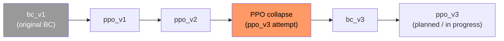

# Model checkpoint lineage

Human-readable history of behavioral-cloning (BC) and PPO checkpoints. Version labels (`bc_v1`, `ppo_v2`, …) are **logical names** used in `agent_version` tags and notes; on-disk filenames do not always match (see [Artifacts](#artifacts-on-disk)).

`models/*.pt` are gitignored — only configs and logs in the repo prove training runs. Keep copies of important checkpoints outside the repo if you need to recover them.

---

## Lineage (current understanding)



| Version | Type | Parent init | Role | Artifact status |
|--------|------|-------------|------|-----------------|
| **bc_v1** | BC | — | First BC policy trained on early `decisions.jsonl` | **Lost** (original `policy_net` weights not recoverable) |
| **ppo_v1** | PPO | `policy_net.pt` (bc_v1 era) | First offline PPO fine-tune on growing dataset | `models/ppo_v1.pt` (local; overwritten by later PPO runs unless copied) |
| **ppo_v2** | PPO | ppo_v1 lineage | Policy used for agent play (`AGENT_VERSION = ppo_v2` in `sts2_agent/main.py`) | `models/ppo_v2.pt` (local; **not** in git at last check) |
| **—** | — | ppo_v2 | **Failed ppo_v3 attempt**: continued PPO from `ppo_v2` | No stable checkpoint kept; see [Collapse: ppo_v3 from ppo_v2](#collapse-ppo_v3-from-ppo_v2) |
| **bc_v3** | BC | Fresh train on expanded data (post-collapse) | Reset BC after PPO collapse; replaces bc_v1 weights in `policy_net.pt` | `models/policy_net.pt` + `models/model_config.json` |
| **ppo_v3** | PPO | `policy_net.pt` (bc_v3) | Next PPO generation (intended) | Not finalized; use `--model-out models/ppo_v3.pt` to avoid clobbering `ppo_v1.pt` |

---

## BC retrain: old BC (bc_v1) vs bc_v3

After the PPO collapse, BC was retrained from scratch on a much larger `decisions.jsonl` (see `model_config.json` → **1119** runs, **57 984** train / **13 645** val samples for bc_v3). The original **bc_v1** checkpoint is gone; metrics below for old BC are from training notes, not a saved config in the repo.

| Metric | Old BC (bc_v1) | bc_v3 |
|--------|----------------|-------|
| Train accuracy | ~59.3% | **69.5%** |
| Val accuracy | *(not recorded)* | **63.0%** |
| `card_reward` accuracy (per state type) | 66.4% | **85.6%** (train); 77.4% (val) |

**Why retrain:** PPO-on-PPO from **ppo_v2** was unstable; a stronger BC base was needed before **ppo_v3**. The `card_reward` jump (66% → 86% train) is the largest per-screen gain and matters directly for deck quality during agent runs.

### bc_v3 full evaluation

From `python training/train.py` final eval (100 epochs). Also stored in `models/model_config.json` → `metrics`.

**Train accuracy: 69.5%** (57 984 samples) · **Val accuracy: 63.0%** (13 645 samples)

| `state_type` | Train | Val |
|--------------|------:|----:|
| **Overall** | **69.5%** | **63.0%** |
| `boss` | 73.1% | 59.6% |
| `card_reward` | 85.6% | 77.4% |
| `card_select` | 57.2% | 45.6% |
| `elite` | 65.8% | 57.3% |
| `event` | 97.1% | 97.0% |
| `hand_select` | 54.5% | 56.3% |
| `map` | 98.1% | 99.4% |
| `monster` | 70.6% | 61.9% |
| `rest_site` | 81.8% | 77.6% |
| `rewards` | 37.0% | 35.9% |
| `shop` | 36.1% | 35.0% |
| `treasure` | 75.6% | 70.3% |

**Weak screens (both splits under 40%):** `rewards`, `shop`. **Strong:** `map`, `event`. **Largest train→val gap:** `boss`, `card_reward`, `monster` (combat / deck-building screens with more action diversity).

---

## Collapse: ppo_v3 from ppo_v2

**Goal:** Train **ppo_v3** by initializing the PPO actor from **ppo_v2** (`--start-from models/ppo_v2.pt`), same offline pipeline as `training/train_ppo.py`.

**Outcome:** Training was unstable from epoch 1 and stopped by entropy early-stop within five epochs. Symptoms:

- **Clip fraction > 50% from epoch 1** (trainer warns and suggests lowering LR).
- **Entropy** started near the stop threshold (~0.76–0.80) and fell below **0.75** by epoch 5.
- **Early stop reason:** `entropy_below_threshold` (not a clean full run).

Recorded in `models/ppo_config.json` (`bc_init`: `models\ppo_v2.pt`) and `logs/ppo_training.log` (2026-05-18). Best epoch by entropy in that run was **epoch 2** (entropy ≈ 0.806); final epoch 5 entropy ≈ 0.697.

| Epoch | Entropy | Clip fraction | Notes |
|------:|--------:|--------------:|-------|
| 1 | 0.799 | 57.6% | clip > 50% immediately |
| 2 | 0.806 | 61.0% | best saved entropy |
| 3 | 0.795 | 64.5% | |
| 4 | 0.750 | 67.4% | |
| 5 | 0.697 | 69.2% | early stop |

Hyperparameters for that attempt (from `ppo_config.json`): `lr=1e-5`, `entropy_coef=0.05`, `entropy_stop=0.75`, dataset **71 622** transitions / **402** runs. Earlier successful **ppo_v1** runs from `policy_net.pt` on the same day had clip fraction **~32%** at epoch 1 — continuing from **ppo_v2** behaved qualitatively worse.

**Response:** Retrain BC as **bc_v3** → `policy_net.pt` (see [BC retrain](#bc-retrain-old-bc-bc_v1-vs-bc_v3)), then plan **ppo_v3** from bc_v3 rather than chaining PPO-on-PPO from a peaked policy.

---

## Artifacts on disk

| Path | Typical version | Written by |
|------|-----------------|------------|
| `models/policy_net.pt` | bc_v3 (current BC) | `python training/train.py` |
| `models/model_config.json` | bc_v3 metadata | `training/train.py` |
| `models/ppo_v1.pt` | **Default PPO output** (often latest experiment, not necessarily “v1”) | `python training/train_ppo.py` (default `--model-out`) |
| `models/ppo_config.json` | Last PPO run metadata | `training/train_ppo.py` |
| `models/ppo_v2.pt` | Play checkpoint for agent | Manual copy / rename (not a train script default) |
| `models/ppo_v3.pt` | (recommended) | `train_ppo.py --model-out models/ppo_v3.pt` |

**Pitfall:** `train_ppo.py` defaults to `--model-out models/ppo_v1.pt`, so repeated experiments overwrite the same file unless you pass `--model-out`. Name checkpoints when you copy them (e.g. `ppo_v2.pt`).

---

## Agent version tags vs checkpoints

Runs and decisions are tagged with `agent_version` (`sts2_agent/main.py` → `set_agent_version()`). Dashboard groups by this field.

| `agent_version` | Intended checkpoint |
|-----------------|---------------------|
| `ppo_v2` | `models/ppo_v2.pt` (inference prefers PPO when present; see `training/inference.py`) |
| (BC play) | `models/policy_net.pt` with `--policy` / BC path |
| Historical tags | e.g. `bc_v1_64runs`, `rules_v1` — see `data/runs.jsonl` / `decisions.jsonl` |

Bump `AGENT_VERSION` in `sts2_agent/main.py` when you change the policy you deploy for data collection.

---

## Training commands (reference)

**BC (bc_v3 → policy_net.pt):**

```bash
python training/train.py
```

**PPO from BC (intended ppo_v3):**

```bash
python training/train_ppo.py \
  --start-from models/policy_net.pt \
  --model-out models/ppo_v3.pt \
  --config-out models/ppo_v3_config.json
```

**PPO from ppo_v2 (failed path — documented for history):**

```bash
python training/train_ppo.py --start-from models/ppo_v2.pt --entropy-stop 0.75
```

Useful flags: `--entropy-stop`, `--entropy-coef`, `--lr`. The value/critic head is always reinitialized; only the actor loads from `--start-from`.

---

## Changelog

| Date | Event |
|------|--------|
| 2026-05-17 | Early PPO on small dataset from bc-era `policy_net.pt`; multiple runs logged to `ppo_v1.pt` |
| 2026-05-17 | Larger-dataset PPO from `policy_net.pt`; entropy stop at epoch 17 (clip frac rose late) |
| 2026-05-18 | ppo_v3-from-ppo_v2 attempts: collapse at epoch ≤5, high clip fraction from start |
| 2026-05-18 | bc_v3 BC train → `model_config.json` / `policy_net.pt` (train 69.5%, val 63.0%; see [BC retrain](#bc-retrain-old-bc-bc_v1-vs-bc_v3)) |

---

## Updating this doc

When you ship a new checkpoint:

1. Add a row to the lineage table (parent, artifact paths, `agent_version`).
2. Append a changelog line with date and outcome.
3. If training failed, add a short metrics table like the collapse section above.
4. Copy `ppo_config.json` / `model_config.json` to a versioned name if you need immutable provenance (`ppo_v3_config.json`).
