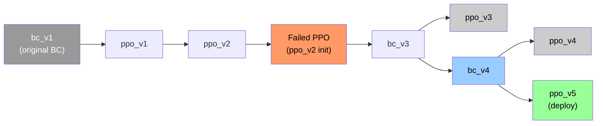

# Model checkpoint lineage

Human-readable history of behavioral-cloning (BC) and PPO checkpoints. Version labels (`bc_v1`, `ppo_v2`, …) are **logical names** used in `agent_version` tags and notes; on-disk filenames do not always match (see [Artifacts](#artifacts-on-disk)).

`models/*.pt` are gitignored — only configs and logs in the repo prove training runs. Keep copies of important checkpoints outside the repo if you need to recover them.

**Forward plan:** [Qwen + PPO roadmap](QWEN_PPO_ROADMAP.md) — when and how to add a strategic LLM layer after PPO plateaus.

**Patches:** [Patch management](PATCH_MANAGEMENT.md) — when to rescrape, retrain BC, or restart the full pipeline.

---

## Lineage (current understanding)



| Version | Type | Parent init | Role | Artifact status |
|--------|------|-------------|------|-----------------|
| **bc_v1** | BC | — | First BC policy trained on early `decisions.jsonl` | **Lost** (original `policy_net` weights not recoverable) |
| **ppo_v1** | PPO | `policy_net.pt` (bc_v1 era) | First offline PPO fine-tune on growing dataset | `models/ppo_v1.pt` (local; overwritten by later PPO runs unless copied) |
| **ppo_v2** | PPO | ppo_v1 lineage | Policy used for agent play (`AGENT_VERSION = ppo_v2` in `sts2_agent/main.py`) | `models/ppo_v2.pt` (local; **not** in git at last check) |
| **—** | — | ppo_v2 | **Failed PPO continuation** from `ppo_v2` (not bc_v3) | No deployable checkpoint; see [Failed PPO from ppo_v2](#failed-ppo-from-ppo_v2) |
| **bc_v3** | BC | Fresh train on expanded data (post-collapse) | Reset BC after ppo_v2-collapse; superseded on disk by bc_v4 | `models/bc_v3.pt` (frozen copy); metrics in [bc_v3 eval](#bc_v3-full-evaluation) |
| **ppo_v3** | PPO | `bc_v3.pt` (bc_v3 actor) | Healthy PPO fine-tune; superseded by ppo_v4 for deploy | `models/ppo_v3.pt` (see [ppo_v3](#ppo_v3-successful)) |
| **bc_v4** | BC | Fresh train on expanded data + updated run-score filter | BC base for ppo_v4 | `models/policy_net.pt`, `models/bc_v4.pt`, `models/model_config.json` (see [bc_v4](#bc_v4)) |
| **ppo_v4** | PPO | `bc_v4.pt` (bc_v4 actor) | Offline PPO on updated run-score dataset; superseded by ppo_v5 | `models/ppo_v4.pt` (see [ppo_v4](#ppo_v4-successful)) |
| **ppo_v5** | PPO | `bc_v4.pt` (bc_v4 actor) | **Current deploy** — aggression-aligned rewards + Phase B training filter | `models/ppo_v5.pt`; live weights in `ppo_v1.pt` (see [ppo_v5](#ppo_v5-successful)) |

---

## BC retrain: old BC (bc_v1) vs bc_v3

After the PPO collapse, BC was retrained from scratch on a much larger `decisions.jsonl` (see `model_config.json` → **1119** runs, **57 984** train / **13 645** val samples for bc_v3). The original **bc_v1** checkpoint is gone; metrics below for old BC are from training notes, not a saved config in the repo.

| Metric | Old BC (bc_v1) | bc_v3 |
|--------|----------------|-------|
| Train accuracy | ~59.3% | **69.5%** |
| Val accuracy | *(not recorded)* | **63.0%** |
| `card_reward` accuracy (per state type) | 66.4% | **85.6%** (train); 77.4% (val) |

**Why retrain:** PPO-on-PPO from **ppo_v2** was unstable; a stronger BC base was needed before a real **ppo_v3** run from bc_v3. The `card_reward` jump (66% → 86% train) is the largest per-screen gain and matters directly for deck quality during agent runs.

### bc_v3 full evaluation

From `python training/train.py` final eval (100 epochs). Also stored in `models/model_config.json` → `metrics`.

**Train accuracy: 69.5%** (57 984 samples) · **Val accuracy: 63.0%** (13 645 samples)

| `state_type` | Train | Val |
|--------------|------:|----:|
| **Overall** | **69.5%** | **63.0%** |
| `boss` | 73.1% | 59.6% |
| `card_reward` | 85.6% | 77.4% |
| `card_select` | 57.2% | 45.6% |
| `elite` | 65.8% | 57.3% |
| `event` | 97.1% | 97.0% |
| `hand_select` | 54.5% | 56.3% |
| `map` | 98.1% | 99.4% |
| `monster` | 70.6% | 61.9% |
| `rest_site` | 81.8% | 77.6% |
| `rewards` | 37.0% | 35.9% |
| `shop` | 36.1% | 35.0% |
| `treasure` | 75.6% | 70.3% |

**Weak screens (both splits under 40%):** `rewards`, `shop`. **Strong:** `map`, `event`. **Largest train→val gap:** `boss`, `card_reward`, `monster` (combat / deck-building screens with more action diversity).

---

## bc_v4

**Goal:** Retrain BC on the larger post–run-score-filter dataset (deck quality + halved HP conservation + damage-efficiency penalty in scoring). Same feature layout (195-dim) as bc_v3 — weights are **not** compatible for warmstart from bc_v3 if feature dim changes later.

**Dataset:** `model_config.json` → **1265** runs, **70 467** train / **18 131** val samples (`min_run_score_percentile`: 25).

**Outcome:** Best BC so far on overall val (+1.4 pp vs bc_v3). Large val gains on `boss` (+9.1 pp) and `card_reward` (+3.8 pp); `card_select` val regressed (45.6% → 38.9%).

**Artifacts:** `python training/train.py` wrote `models/policy_net.pt` and `models/model_config.json`. Copy to `models/bc_v4.pt` before the next BC or PPO run overwrites them.

### bc_v3 vs bc_v4

| Metric | bc_v3 | **bc_v4** |
|--------|------:|----------:|
| Runs in dataset | 1119 | **1265** |
| Train samples | 57 984 | **70 467** |
| Val samples | 13 645 | **18 131** |
| Train accuracy | 69.5% | **72.0%** |
| Val accuracy | 63.0% | **64.4%** |
| `boss` val | 59.6% | **68.7%** |
| `card_reward` val | 77.4% | **81.6%** |
| `monster` val | 61.9% | **65.3%** |
| `card_select` val | 45.6% | 38.9% |

### bc_v4 full evaluation

From `python training/train.py` final eval (100 epochs). Stored in `models/model_config.json` → `metrics`.

**Train accuracy: 72.0%** (70 467 samples) · **Val accuracy: 64.4%** (18 131 samples)

| `state_type` | Train | Val |
|--------------|------:|----:|
| **Overall** | **72.0%** | **64.4%** |
| `boss` | 78.3% | 68.7% |
| `card_reward` | 86.5% | 81.6% |
| `card_select` | 53.4% | 38.9% |
| `elite` | 69.6% | 56.4% |
| `event` | 97.6% | 97.9% |
| `hand_select` | 54.3% | 60.5% |
| `map` | 98.8% | 98.5% |
| `monster` | 74.4% | 65.3% |
| `rest_site` | 84.2% | 77.8% |
| `rewards` | 35.3% | 34.5% |
| `shop` | 36.3% | 35.1% |
| `treasure` | 77.5% | 69.5% |

**Weak screens (unchanged):** `rewards`, `shop`. **Notable val gains vs bc_v3:** `boss`, `card_reward`, `monster`, `hand_select`. **Regression:** `card_select` val.

---

## Failed PPO from ppo_v2

**Goal:** Continue offline PPO from **ppo_v2** (`--start-from models/ppo_v2.pt`) — same pipeline as `training/train_ppo.py`, *not* from bc_v3.

**Outcome:** Unstable from epoch 1; entropy early-stop within five epochs. Recorded in `logs/ppo_training.log` (2026-05-18 morning; `bc_init`: `models\ppo_v2.pt` in an earlier `ppo_config.json` snapshot).

| Epoch | Entropy | Clip fraction | Notes |
|------:|--------:|--------------:|-------|
| 1 | 0.799 | 57.6% | clip > 50% immediately |
| 2 | 0.806 | 61.0% | best saved entropy |
| 3 | 0.795 | 64.5% | |
| 4 | 0.750 | 67.4% | |
| 5 | 0.697 | 69.2% | early stop |

**Response:** Retrain BC as **bc_v3**, then train **ppo_v3** from bc_v3 (see below).

---

## ppo_v3 (successful)

**Goal:** Offline PPO with actor init from **bc_v3** (`--start-from models/bc_v3.pt` or `policy_net.pt` after BC train). Value head reinitialized each run (default `train_ppo.py` behavior).

**Outcome:** Healthy training — good enough to deploy. Log + `models/ppo_config.json` (2026-05-18, `bc_init`: `models\bc_v3.pt`).

### Failed ppo_v2-init vs successful ppo_v3 (bc_v3-init)

| Metric | Failed PPO (`ppo_v2` init) | **ppo_v3** (`bc_v3` init) |
|--------|---------------------------|---------------------------|
| Starting entropy | 0.76 (already collapsed) | **0.95** (healthy) |
| Clip fraction | 57–69% (thrashing) | **30–42%** (reasonable) |
| Epochs completed | 1–5 | **10** |
| Best checkpoint | epoch 2 | **epoch 1** (entropy **0.95**) |
| Early stop | epoch 5 (`entropy_stop` 0.75) | epoch 10 (`entropy_stop` 0.80) |

### ppo_v3 training log (per epoch)

| Epoch | Entropy | Clip fraction |
|------:|--------:|--------------:|
| 1 | **0.951** | 30.5% |
| 2 | 0.937 | 30.4% |
| 3 | 0.930 | 31.6% |
| 4 | 0.914 | 33.1% |
| 5 | 0.894 | 34.4% |
| 6 | 0.875 | 35.7% |
| 7 | 0.853 | 37.2% |
| 8 | 0.836 | 38.8% |
| 9 | 0.816 | 40.6% |
| 10 | 0.781 | 42.5% |

**Deploy checkpoint:** weights at **epoch 1** (`best_entropy_at_save` ≈ 0.951). Copy to `models/ppo_v3.pt` for inference; bump `AGENT_VERSION` to `ppo_v3` in `sts2_agent/main.py` when switching play data collection.

**Note:** Default `train_ppo.py --model-out` wrote to `ppo_v1.pt` during this run — use an explicit `--model-out models/ppo_v3.pt` next time to avoid ambiguity.

---

## ppo_v4 (successful)

**Goal:** Offline PPO with actor init from **bc_v4** (`--start-from models/bc_v4.pt`). Rewards use the updated run-score formula (HP ×50, deck quality, damage-efficiency penalty). Value head reinitialized (default `train_ppo.py`).

**Outcome:** Healthy training — early stop at epoch 8 (`entropy_stop` 0.80). Log + `models/ppo_config.json` (2026-05-18 17:03, `bc_init`: `models\bc_v4.pt`).

**Dataset (PPO):** `ppo_config.json` → **498** runs, **70 467** train / **18 131** val transitions (`min_run_score_percentile`: 25). Reward normalization: `return_std` ≈ **89.2** (raw run-score scale).

### ppo_v3 vs ppo_v4

| Metric | **ppo_v3** (`bc_v3`) | **ppo_v4** (`bc_v4`) |
|--------|---------------------:|---------------------:|
| BC parent val accuracy | 63.0% | **64.4%** |
| PPO runs in dataset | *(not recorded)* | **498** |
| Starting entropy (epoch 1) | **0.951** | 0.895 |
| Best saved entropy | **0.951** (epoch 1) | **0.895** (epoch 1) |
| Clip fraction range | 30–42% | **30–39%** |
| Epochs completed | 10 | **8** (early stop) |
| Early stop reason | entropy 0.781 < 0.80 | entropy **0.796** < 0.80 |

Both runs show the same healthy profile (clip ~30–40%, no ppo_v2-style thrashing). ppo_v4 starts slightly lower entropy because bc_v4 is a sharper BC policy.

### ppo_v4 training log (per epoch)

| Epoch | Entropy | Clip fraction | Val value mean |
|------:|--------:|--------------:|---------------:|
| 1 | **0.895** | 30.2% | -0.197 |
| 2 | 0.885 | 31.1% | -0.006 |
| 3 | 0.872 | 32.3% | 0.152 |
| 4 | 0.851 | 33.3% | 0.286 |
| 5 | 0.830 | 34.2% | 0.396 |
| 6 | 0.812 | 35.3% | 0.477 |
| 7 | 0.804 | 37.1% | 0.545 |
| 8 | 0.796 | 39.0% | **0.587** |

**Deploy checkpoint:** weights at **epoch 1** (`best_entropy_at_save` ≈ **0.895**). Copied to `models/ppo_v4.pt`; `AGENT_VERSION = ppo_v4` in `sts2_agent/main.py`.

**Pitfall (again):** Default `--model-out` wrote checkpoints to `models/ppo_v1.pt` during training — that file currently holds ppo_v4 epoch-1 weights until overwritten. Use `--model-out models/ppo_v4.pt` next time. Inference `resolve_model_paths()` still prefers `ppo_v1.pt` when present; keep `ppo_v4.pt` in sync or pass explicit paths.

---

## ppo_v5 (successful)

**Goal:** Offline PPO from **bc_v4** with **relabeled combat rewards** (damage-first `combat_turn_shaping`) and **`--clean-only`** training data (agent decisions only from Phase B runs with `combat_summary`). Skipped bc_v5 retrain — same passive demonstrations, new reward labels.

**Command:**

```bash
py -m training.train_ppo --start-from models/bc_v4.pt --lr 1e-5 --epochs 50 --device cuda
```

**Outcome:** Best PPO training run so far on entropy — policy stayed exploratory for **20 epochs** before `entropy_stop` (0.80). Log + `models/ppo_config.json` (`bc_init`: `models\bc_v4.pt`).

**Dataset (PPO):** Phase B filter → **10 463** train transitions from **137** Phase B runs (`clean_only`; **84 079** agent decisions discarded). Same score-percentile gate as prior PPO runs. Reward normalization: `return_std` ≈ **66.4**.

### ppo_v3 vs ppo_v4 vs ppo_v5

| Metric | **ppo_v3** | **ppo_v4** | **ppo_v5** |
|--------|----------:|----------:|----------:|
| BC init | bc_v3 | bc_v4 | bc_v4 |
| Training filter | all agent runs | score percentile | **Phase B + score percentile** |
| Step reward | old shaping | old shaping | **damage-first shaping (relabeled)** |
| Starting entropy (epoch 1) | 0.951 | 0.895 | **0.986** |
| Best saved entropy | 0.951 (epoch 1) | 0.895 (epoch 1) | **1.015 (epoch 9)** |
| Clip fraction (epoch 1) | 30.5% | 30.2% | **30.7%** |
| Epochs completed | 10 | 8 | **20** |
| Early stop | entropy 0.781 | entropy 0.796 | entropy **0.785** (epoch 20) |

Entropy **rose** through epoch 9 before decay — unlike ppo_v3/ppo_v4, the best checkpoint is **not** epoch 1. `train_ppo.py` saves the actor at **maximum epoch entropy** (`best_entropy_at_save` ≈ **1.015**).

### ppo_v5 training log (selected epochs)

| Epoch | Entropy | Clip fraction | Val value mean |
|------:|--------:|--------------:|---------------:|
| 1 | 0.986 | 30.7% | 0.510 |
| 2 | 0.987 | 30.7% | 1.262 |
| 9 | **1.015** | 35.5% | 3.336 |
| 15 | 0.954 | 43.3% | 3.579 |
| 20 | 0.785 | 51.7% | 3.628 |

Full per-epoch history in `models/ppo_config.json` → `history`.

**Deploy:** `models/ppo_v1.pt` holds the **epoch-9** actor (highest entropy). Copy to `models/ppo_v5.pt` for lineage; set `AGENT_VERSION = ppo_v5` in `sts2_agent/main.py`. Inference loads **`ppo_v1.pt` first** — no need to touch `policy_net.pt`.

**Collection goal:** ~150 runs; dashboard check that damage/turn nudges above the old ~8 passive baseline before training **bc_v6** on new data.

---

## Artifacts on disk

| Path | Typical version | Written by |
|------|-----------------|------------|
| `models/policy_net.pt` | **bc_v4** (latest BC) | `python training/train.py` |
| `models/bc_v3.pt` | bc_v3 actor (frozen) | Manual copy before bc_v4 train |
| `models/bc_v4.pt` | bc_v4 actor for PPO `--start-from` | Manual copy of `policy_net.pt` after bc_v4 train |
| `models/model_config.json` | **bc_v4** metadata | `training/train.py` |
| `models/ppo_v1.pt` | **Inference default** — **ppo_v5** epoch-9 actor (best entropy) | `training/train_ppo.py` (default `--model-out`) |
| `models/ppo_v2.pt` | Historical play checkpoint | Manual copy / rename |
| `models/ppo_v3.pt` | ppo_v3 deploy (frozen) | Copy from bc_v3 PPO run |
| `models/ppo_v4.pt` | ppo_v4 deploy (frozen) | `Copy-Item models/ppo_v1.pt` after ppo_v4 train |
| `models/ppo_v5.pt` | **ppo_v5 lineage copy** | `Copy-Item models/ppo_v1.pt models/ppo_v5.pt` after train |
| `models/ppo_config.json` | **ppo_v5** metadata (last PPO run) | `training/train_ppo.py` |

**Pitfall:** `train_ppo.py` defaults to `--model-out models/ppo_v1.pt`, so repeated experiments overwrite the same file unless you pass `--model-out`. Name checkpoints when you copy them (e.g. `ppo_v2.pt`).

---

## Agent version tags vs checkpoints

Runs and decisions are tagged with `agent_version` (`sts2_agent/main.py` → `set_agent_version()`). Dashboard groups by this field.

| `agent_version` | Intended checkpoint |
|-----------------|---------------------|
| **`ppo_v5`** | `models/ppo_v1.pt` at runtime (copy in `ppo_v5.pt`; `AGENT_VERSION` in `main.py`) |
| `ppo_v4` | `models/ppo_v4.pt` (historical play runs) |
| `ppo_v3` | `models/ppo_v3.pt` (historical play runs) |
| `ppo_v2` | `models/ppo_v2.pt` (historical play runs) |
| **`bc_v4`** | `models/policy_net.pt` / `bc_v4.pt` with `--policy` |
| (BC play, legacy) | `bc_v3.pt` with `--policy` + `AGENT_VERSION=bc_v3` |
| Historical tags | e.g. `bc_v1_64runs`, `rules_v1` — see `data/runs.jsonl` / `decisions.jsonl` |

Bump `AGENT_VERSION` in `sts2_agent/main.py` when you change the policy you deploy for data collection.

---

## Training commands (reference)

**BC (bc_v4 → policy_net.pt):**

```bash
python training/train.py
# then: copy models\policy_net.pt models\bc_v4.pt
```

**PPO from bc_v4 (ppo_v5 — current deploy):**

```bash
python training/train_ppo.py \
  --start-from models/bc_v4.pt \
  --model-out models/ppo_v1.pt \
  --lr 1e-5 \
  --epochs 50 \
  --device cuda
# Copy-Item models/ppo_v1.pt models/ppo_v5.pt
```

**PPO from bc_v4 (ppo_v4 — previous):**

```bash
python training/train_ppo.py \
  --start-from models/bc_v4.pt \
  --model-out models/ppo_v4.pt \
  --config-out models/ppo_v4_config.json
```

**PPO from bc_v3 (ppo_v3 — previous deploy):**

```bash
python training/train_ppo.py \
  --start-from models/bc_v3.pt \
  --model-out models/ppo_v3.pt \
  --config-out models/ppo_v3_config.json
```

**PPO from ppo_v2 (failed — do not use):**

```bash
python training/train_ppo.py --start-from models/ppo_v2.pt --entropy-stop 0.75
```

Useful flags: `--entropy-stop`, `--entropy-coef`, `--lr`. The value/critic head is always reinitialized; only the actor loads from `--start-from`.

---

## Changelog

| Date | Event |
|------|--------|
| 2026-05-17 | Early PPO on small dataset from bc-era `policy_net.pt`; multiple runs logged to `ppo_v1.pt` |
| 2026-05-17 | Larger-dataset PPO from `policy_net.pt`; entropy stop at epoch 17 (clip frac rose late) |
| 2026-05-18 | Failed PPO from `ppo_v2` init: collapse ≤5 epochs, clip 57–69% (see [Failed PPO](#failed-ppo-from-ppo_v2)) |
| 2026-05-18 | bc_v3 BC train → `model_config.json` / `policy_net.pt` (train 69.5%, val 63.0%; see [BC retrain](#bc-retrain-old-bc-bc_v1-vs-bc_v3)) |
| 2026-05-18 | **ppo_v3** from `bc_v3.pt`: 10 epochs, best epoch 1 entropy 0.95, clip 30–42% — deploy candidate (see [ppo_v3](#ppo_v3-successful)) |
| 2026-05-18 | **bc_v4** BC train → `policy_net.pt` / `model_config.json` (train 72.0%, val 64.4%; 1265 runs; see [bc_v4](#bc_v4)) |
| 2026-05-18 | **ppo_v4** from `bc_v4.pt`: 8 epochs, best epoch 1 entropy 0.895, clip 30–39% — deploy (`ppo_v4.pt`; see [ppo_v4](#ppo_v4-successful)) |
| 2026-05-18 | **ppo_v5** from `bc_v4.pt`: 20 epochs, best epoch **9** entropy **1.015**, clip 30.7–52% — deploy via `ppo_v1.pt` (see [ppo_v5](#ppo_v5-successful)) |

---

## Updating this doc

When you ship a new checkpoint:

1. Add a row to the lineage table (parent, artifact paths, `agent_version`).
2. Append a changelog line with date and outcome.
3. If training failed, add a short metrics table like the collapse section above.
4. Copy `ppo_config.json` / `model_config.json` to a versioned name if you need immutable provenance (`ppo_v3_config.json`).
