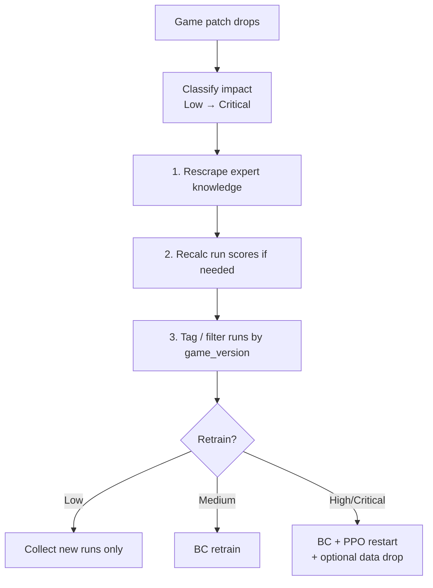

# Patch management

How to respond when *Slay the Spire 2* balance or mechanics change. Goal: keep **training data**, **expert knowledge**, and **model checkpoints** aligned with the game the agents are actually playing.

**Related:**

- [Qwen + PPO roadmap](QWEN_PPO_ROADMAP.md) — living `expert_knowledge.json` and retrain cycles
- [Model checkpoint lineage](MODEL_LINEAGE.md) — when BC/PPO must restart vs continue

---

## Patch impact classification

Classify every game update before touching models. When in doubt, **round up** one level.

| Level | Typical changes | Model / data impact |
|-------|-----------------|---------------------|
| **Low** | Number tweaks (damage, costs, HP, gold) | Rescrape knowledge; new runs adapt via exploration. Usually **no** retrain. |
| **Medium** | Card / relic / potion **reworks** (effect text, scaling, rarity shifts) | Rescrape + **BC retrain**. PPO may continue from new BC warmstart if `FEATURE_DIM` unchanged. |
| **High** | New mechanics, new `state_type`s, new action types, feature-relevant UI | **`FEATURE_DIM` change** → full **BC + PPO restart** (no weight warmstart from old checkpoints). |
| **Critical** | Core systems rework (combat rules, reward structure, API contract) | Possible **data invalidation** — filter or discard pre-patch `decisions.jsonl` / runs. |



---

## Standard response per level

Actions apply **in order**. Step 1 is always mandatory.

| Step | Low | Medium | High | Critical |
|------|:---:|:------:|:----:|:--------:|
| Rescrape `cache/expert_knowledge.json` | ✓ | ✓ | ✓ | ✓ |
| Recalculate `run_score` in `runs.jsonl` if formula changed | if needed | if needed | if needed | if needed |
| Bump / record **game version** on new runs | ✓ | ✓ | ✓ | ✓ |
| Filter pre-patch data from training | — | optional | ✓ | ✓ |
| **BC retrain** (`training/train.py`) | — | ✓ | ✓ | ✓ |
| **PPO retrain** (`training/train_ppo.py`) | — | warmstart from new BC | full restart | full restart |
| Rules / validation updates (`action_validate`, handlers) | — | if behavior changed | ✓ | ✓ |

### Always first: knowledge base

```bash
python tools/scrape_knowledge.py
```

Writes `cache/expert_knowledge.json` (Mobalytics tiers + guides). Used by:

- `sts2_agent/knowledge.py` (rules scoring)
- Future Qwen prompts ([roadmap](QWEN_PPO_ROADMAP.md))

Stale tiers after a patch actively mislead both rules and strategic LLM calls.

### Run scores

`run_score()` lives in `sts2_agent/scorer.py` (see `tools/tune_run_score.py`). Training filters runs by percentile via `min_run_score_percentile` in `training/train.py` and `training/ppo_dataset.py`.

If the scoring formula changes:

1. Update `run_score()` and document the change in this file’s changelog.
2. **Backfill** `run_score` on existing `data/runs.jsonl` rows (script TBD) or exclude old runs from training until recomputed.
3. Re-derive percentile cutoffs — old “top 25%” is not comparable across formulas.

### BC vs full pipeline restart

| Signal | Action |
|--------|--------|
| Card/relic **behavior** changed (not just numbers) | BC retrain on post-patch data (or mixed with filtered pre-patch) |
| `FEATURE_DIM` changed in `training/features.py` | New `policy_net` + **cannot** warmstart PPO from old `.pt` files |
| New actions in vocab | Rebuild action vocab → BC + PPO; see [model lineage](MODEL_LINEAGE.md) |

---

## Data management

### Game version tagging (required practice)

**Today:** runs record `agent_version`, `character`, `ascension`, timestamps (`sts2_agent/data_pipeline.py` → `data/runs.jsonl`). Decisions mirror `agent_version` in `data/decisions.jsonl`.

**Target:** add a stable **`game_version`** (or `patch_id`) field on every run and decision, set at run start from config/env, e.g.:

```json
{
  "run_id": "...",
  "game_version": "2026.05.18",
  "agent_version": "ppo_v3",
  "run_score": 412.5
}
```

| Use | Why |
|-----|-----|
| Dashboard filters | Compare floor progress pre/post patch |
| Training | `load_decision_rows(..., min_game_version=...)` excludes invalid eras |
| Forensics | Know which checkpoint was trained on which patch |

**Critical patches:** drop or quarantine pre-patch rows when mechanics invalidate `state_snapshot` or actions (e.g. removed `state_type`, renamed actions).

### Existing tags

| Field | Meaning |
|-------|---------|
| `agent_version` | Policy / rules generation (`ppo_v3`, `rules_v1`, …) |
| `source` | `agent` vs human import |
| `collector_instance` | Parallel agent slot |

Do not confuse `agent_version` with game patch — both are needed.

### Training data integrity

| Patch level | Suggested training set |
|-------------|------------------------|
| Low | Pool all runs; optionally weight recent patch higher |
| Medium | Prefer post-patch; include pre-patch only if card IDs unchanged |
| High | **Post-patch only** for BC/PPO |
| Critical | Fresh collection window; treat pre-patch as archive |

Document the cutoff in [MODEL_LINEAGE.md](MODEL_LINEAGE.md) when you ship a new checkpoint.

---

## Patch response checklist (copy per release)

```markdown
## Patch YYYY.MM.DD — [title]

- [ ] Impact level: Low / Medium / High / Critical
- [ ] `python tools/scrape_knowledge.py` (+ manual synergy notes if needed)
- [ ] `run_score` formula changed? → backfill runs.jsonl
- [ ] `game_version` string decided: __________
- [ ] Pre-patch runs excluded from training? Y/N — cutoff: __________
- [ ] BC retrain required? Y/N
- [ ] FEATURE_DIM / action vocab changed? Y/N → full BC+PPO restart
- [ ] New checkpoint lineage entry + agent_version bump
- [ ] Human runs re-imported / spot-checked post-patch
```

---

## The silver lining

The [self-improving architecture](QWEN_PPO_ROADMAP.md#long-term-vision--self-improving-system) is **naturally patch-resilient** if you treat patches as routine cycle triggers:

| Property | Patch benefit |
|----------|----------------|
| **Living knowledge base** | Rescrape + discovery loop refreshes strategy without redesigning the agent |
| **Continuous retrain cycle** | A patch is “retrain sooner,” not a special one-off crisis |
| **Human runs as anchor** | Compare agent vs human floor/score **per `game_version`** — fast signal when behavior diverges post-patch |
| **PPO exploration** | Low patches often need only new runs + updated tiers, not months of manual theory |

Patches hurt most when knowledge, features, and data are **implicitly frozen**. This project’s explicit versioning and rescrape path is the mitigation.

---

## Tooling reference

| Task | Location |
|------|----------|
| Scrape tiers / archetypes | `tools/scrape_knowledge.py` → `cache/expert_knowledge.json` |
| Run scoring | `sts2_agent/scorer.py` → `run_score()` |
| Tune score weights | `tools/tune_run_score.py` |
| BC train | `training/train.py` |
| PPO train | `training/train_ppo.py` |
| Feature layout | `training/features.py` → `FEATURE_DIM`, `model_config.json` |
| Run/decision logs | `data/runs.jsonl`, `data/decisions.jsonl` |

---

## Changelog

| Date | Note |
|------|------|
| 2026-05-18 | Initial patch management doc; `game_version` tagging documented as target schema |
