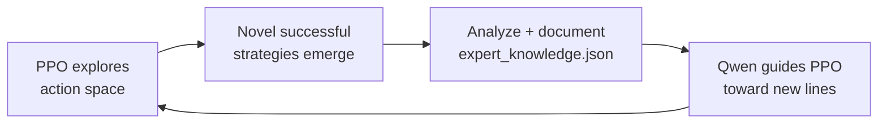
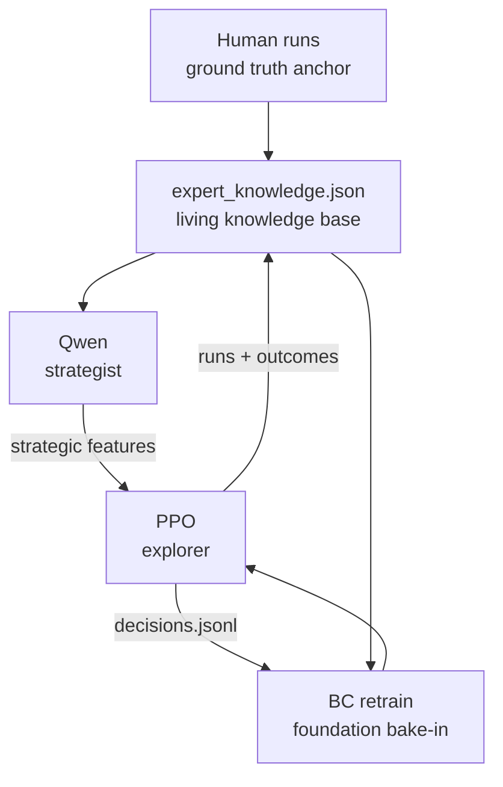
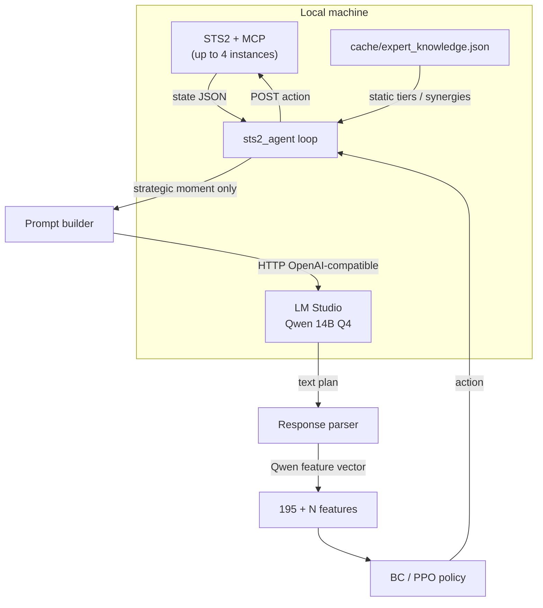
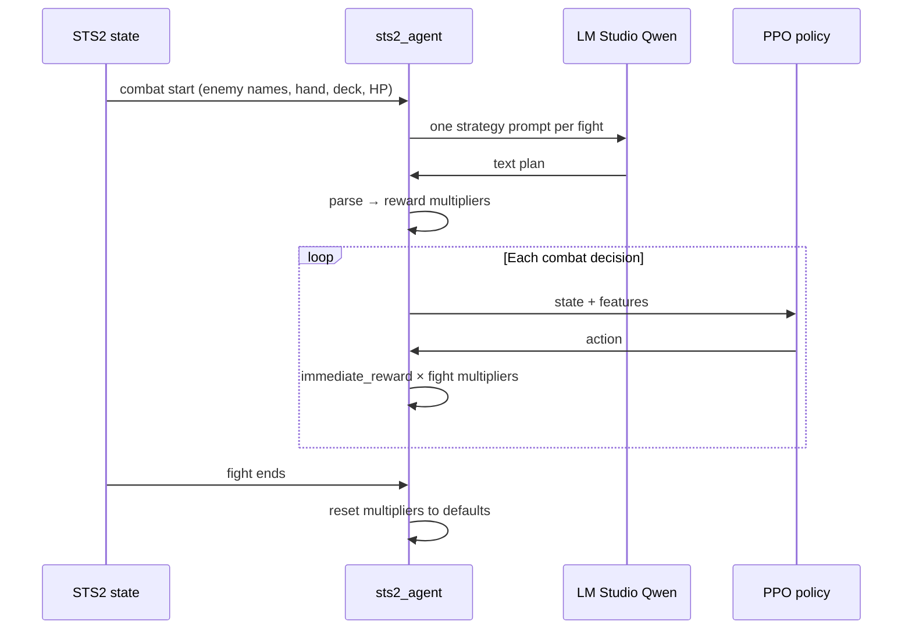
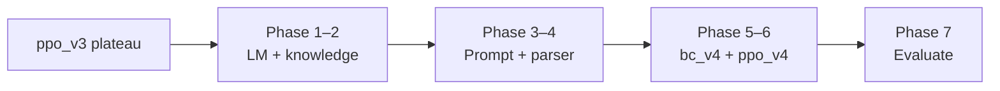
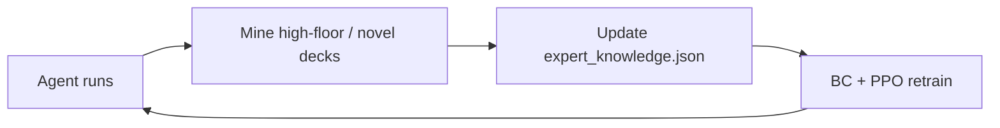

# Qwen + PPO roadmap

Strategic plan for a **self-improving** agent — not “bolt Qwen onto PPO for a few more floors,” but a living system that **evolves its own knowledge** each cycle. Near term: add a **Qwen** reasoning layer on top of **BC / PPO**. Long term: close the loop so discoveries in play rewrite `expert_knowledge.json`, retrain the foundation, and explore again.

**Related:** [Model checkpoint lineage](MODEL_LINEAGE.md) (current `ppo_v3`, BC retrain history).

---

## Long-term vision — self-improving system

The goal is **not** a static model shipped once. It is a **living, evolving system**:

- Each cycle **generates new knowledge** that feeds the next cycle.
- The system can surface **novel strategies** no human guide has documented.
- Human-curated tiers (Mobalytics, guides) are the **bootstrap**, not the ceiling.

Qwen integration is **phase one** of that loop — giving PPO a strategic channel. The full loop is what removes the theoretical cap.

### The knowledge generation loop

| Step | What happens |
|------|----------------|
| 1 | **PPO** explores the probability space with minimal human bias in the action head |
| 2 | **Novel successes** appear — runs that work but contradict or extend what Qwen / the knowledge base currently believe |
| 3 | Those outcomes are **analyzed and written** into `cache/expert_knowledge.json` (synergies, contextual tiers, archetype notes) |
| 4 | **Qwen** reads the updated base and **intentionally steers** the next wave of exploration |
| 5 | **PPO** probes variations of those strategies; new discoveries emerge |
| 6 | **Repeat** — each plateau becomes a signal to **expand the knowledge base**, not to stop |

This is the core product: **documentation and strategy discovery as a first-class output**, not only higher floor numbers on a fixed policy.

### Why this has no theoretical ceiling (in principle)

| Limitation | How the loop addresses it |
|------------|---------------------------|
| Pure PPO hits **local optima** | It only optimizes what the **195 (+N) features** can represent |
| Fixed human knowledge caps advice | **Living** `expert_knowledge.json` grows after each discovery cycle |
| Plateau on a given feature set | Plateau → **expand knowledge** → new features / priors → **new regions** for PPO to explore |
| Distillation of human play only | System **surpasses and extends** human docs — it does not stop at them |

In practice, balance patches, compute, and patch cadence still bound real-world progress. Philosophically, every plateau is **“expand the map,”** not **“we’re done.”**

### Five components — how they feed each other

| Component | Role |
|-----------|------|
| **PPO** | Explorer — finds novel action sequences through stochastic policy and offline RL |
| **Qwen** | Strategist — contextualizes discoveries, compresses run state into guidance PPO can use |
| **`expert_knowledge.json`** | Living knowledge base — Mobalytics seed + **machine-discovered** synergies and tiers |
| **BC retrain** | Each cycle bakes new knowledge into the **foundation** (imitation + expanded features) |
| **Human runs** | Ground-truth anchor — prevents drift from what actually wins in human hands |

Integration phases below are **cycle 0 → cycle 1** wiring (Qwen + features + retrain). Later cycles add **automated or semi-automated** “discover → document → retrain” tooling (not yet specified here).

### Surpassing human play (design targets)

Not by copying humans harder, but by properties humans do not have at scale:

| Advantage | Mechanism |
|-----------|-----------|
| **Consistency** | No tilt, fatigue, or session variance — every run at peak execution |
| **Perfect recall** | Full card / relic / interaction graph in the knowledge base + features |
| **No ego** | No sunk-cost attachment to a failing line; policy + knowledge update when evidence shifts |
| **Novel discovery** | PPO explores without preconception; successful weird lines get **documented**, not dismissed |

The system becomes an **extension** of human knowledge — same game, strictly larger strategy map over time.

### Philosophical endpoint

After enough cycles, the intended end state is:

- Every **viable strategy cluster** explored and represented in the knowledge base
- **Synergies and lines** no wiki or tier list captured
- A knowledge base **richer than any single human player’s mental model**
- Execution at **machine consistency** on top of that map

At that point the project is not only a strong STS2 bot — it is arguably the **most complete STS2 strategic artifact** that exists: playable policy plus documented theory discovered in play.

---

## Current state and why Qwen (near-term)

| Topic | Summary |
|--------|---------|
| **PPO ceiling (estimate)** | Floor **15–18** on current feature set and data |
| **Root cause** | PPO only sees **~195 features** encoding the *current* screen — no macro strategy |
| **Behavior at ceiling** | Policy becomes **deterministic** (local optimum): weak on synergies, archetypes, multi-floor planning |
| **Qwen role (cycle 0)** | Opens the **strategic channel** so the [knowledge loop](#the-knowledge-generation-loop) can run — not a one-off buff |

Today’s pipeline (`training/features.py` → BC → PPO) is strong at reactive combat and screen-local choices. It is not designed to represent deck identity, patch meta, or long-horizon tradeoffs unless those are explicitly featurized.

---

## Prerequisites before integration

Do **not** bolt Qwen on while PPO is still climbing — you waste integration effort and pollute ablations.

1. **PPO plateau** — two consecutive model versions each improve average floor by **less than 1** vs the prior version.
2. **Solid foundation** — plateau confirms the 195-dim policy has extracted what offline RL can from the current dataset.
3. **Dataset diversity** — plateau after broad `decisions.jsonl` collection gives Qwen varied runs to reason about (deck shapes, paths, mistakes).
4. **Fresh expert knowledge** — `cache/expert_knowledge.json` (from `tools/scrape_knowledge.py`) regenerated on the **latest balance patch** before any Qwen prompts go live.

---

## High-level architecture

**Pattern:** retrieval-augmented generation (RAG) at decision time — **no Qwen fine-tuning**. Knowledge is injected via prompts; outputs are distilled into numbers PPO already knows how to use.

| Step | What happens |
|------|----------------|
| 1 | **LM Studio** runs locally, exposing an OpenAI-compatible HTTP API |
| 2 | At **strategic moments**, the agent builds a prompt: static knowledge + dynamic run state + a focused question |
| 3 | **Qwen** returns strategic advice as text |
| 4 | A **parser** converts text → fixed **numerical features** (concatenated with existing encoding) |
| 5 | **PPO** (same action space) chooses the final action from the expanded vector |

Combat stays on the learned policy; Qwen never blocks the hot path for every card play.

---

## When to call Qwen

| Call Qwen | Do not call Qwen |
|-----------|------------------|
| Card rewards | Every combat **decision** (card play / end turn) |
| Rest sites | Map nodes (unless explicitly added later) |
| Shop | Hand selection / targeting mid-fight |
| Boss prep / pre-boss deck checks | — |
| **Combat start** (once per fight — [combat strategy](#combat-strategy-guidance)) | — |

**Rationale**

- **Latency** — Qwen is too slow for 4 parallel agents polling every ~0.5s.
- **Reactivity** — combat needs millisecond-scale policy inference; PPO is already trained for that.
- **Persistence** — one Qwen response can **persist** (cached feature vector + summary) across several downstream decisions until the next strategic moment (e.g. shop → multiple purchases without re-querying).

Exact trigger list is an [open decision](#open-questions-decide-at-integration-time).

**Exception — combat strategy (once per fight):** see [Combat strategy guidance](#combat-strategy-guidance). Qwen is **not** called every card play; it **is** called once at fight start to set per-fight reward shaping. That is separate from shop/map/reward strategic moments above.

---

## Combat strategy guidance

Per-enemy combat strategy via Qwen at **fight start**, distilled into **dynamic reward multipliers** for the duration of that fight. PPO still chooses every card play; Qwen only answers “how hard should we press this fight?”

This addresses a gap the dashboard and Phase B diagnostics surfaced: a **static** `combat_turn_shaping()` formula cannot encode that different enemies need opposite tempos.

### Diagnostic context (why this exists)

Agent losses cluster on **scaling** encounters where passive play is catastrophic:

| Enemy | Pattern | Strategic need |
|-------|---------|----------------|
| **Kin Follower** | Spawns additional enemies over time | Kill fast before the fight scales |
| **Bygone Effigy** | Gains strength per turn | Burst damage within ~3 turns |
| **Birdonis** | General scaling mechanics | Aggressive early pressure |

These share a pattern: **long fights get worse**. The current passive PPO style (high block, low damage) is especially punished here. Win-rate and death charts on `ppo_v4` / `ppo_v5` runs show these labels repeatedly in fatal fights and low win-rate buckets.

A single global reward formula (e.g. fixed weights on `damage_dealt`, `hp_lost`, `block_applied`) cannot express “be greedy vs Kin” vs “survive one more turn vs this boss telegraph” without per-fight context.

### Design principle

| Layer | Responsibility |
|-------|----------------|
| **Qwen** | High-level fight plan — aggression, focus target, tempo |
| **PPO** | Card selection, targeting, sequencing — already trained for execution |
| **Reward shaping** | Bridge — turn Qwen’s plan into multipliers on existing combat step rewards |

Qwen does **not** need to know *how* to play cards. It only needs outputs like “high aggression — kill within 3 turns” or “conserve HP — boss hits hard next turn.” PPO handles the rest under those incentives.

### Architecture

#### 1. Trigger

- At **combat start**, the agent reads enemy names from game state (Phase B / `combat_summary` path already identifies encounters).
- **One Qwen call per fight** — before the first combat decision.
- **Blocks synchronously at combat start** (up to 10s timeout) so turn 1 uses the right multipliers; never called mid-fight.

#### 2. Input to Qwen

| Input | Source |
|-------|--------|
| Enemy names and room type (`monster` / `elite` / `boss`) | Current `state_type` + `battle.enemies` |
| Hand composition | Player hand in state JSON |
| Deck composition and size | Run deck snapshot |
| Current HP, max HP, block | `player` fields |
| Enemy patterns (scaling, spawn, strength gain) | `cache/expert_knowledge.json` (Mobalytics + curated notes) |

Prompt builder retrieves relevant enemy entries from the knowledge base (RAG-style), same source of truth as [Knowledge base requirements](#knowledge-base-requirements).

#### 3. Qwen output

Free-form **fight strategy** (short), then a structured parse into multipliers applied to `combat_turn_shaping()` for this fight only:

| Field | Example values |
|-------|----------------|
| Strategy summary | “High aggression — kill back line before Kin Follower spawns” |
| `damage_dealt` multiplier | e.g. `1.5` when burst is required |
| `hp_lost` multiplier | e.g. `1.2` when trading HP for speed is acceptable |
| `block_applied` multiplier | e.g. `0.5` when turtling is wrong |

Example strategy phrases Qwen might emit:

- “High aggression — kill within 3 turns”
- “Target back enemy first”
- “Conserve HP — boss hits hard next turn”

Parser maps text → bounded multiplier tuple; invalid or missing output → **default multipliers** (today’s static behavior).

#### 4. Integration with PPO

- Modified weights apply **only for the current fight** (from combat start until `_end_combat`).
- PPO inference unchanged — same action space and feature vector.
- Step rewards in `sts2_agent` use `combat_turn_shaping(..., multipliers=fight_weights)` so online play matches training semantics once Phase 1 lands.
- When the fight ends, multipliers **reset** to defaults; the next fight may trigger a new Qwen call.

#### 5. Why this works

| Property | Benefit |
|----------|---------|
| **Separation of concerns** | Qwen = strategy; PPO = execution |
| **One call per fight** | Latency acceptable (~seconds once per encounter, not per card) |
| **Per-enemy nuance** | Scaling fights get “kill fast”; others can keep balanced weights |
| **Grounded patterns** | `expert_knowledge.json` already holds Mobalytics enemy data — extend with scaling/spawn notes |
| **Measurable** | Dashboard win rate per enemy (`enemy_fight_win_rates`) tracks Kin / Effigy / Birdonis after rollout |

Static global shaping optimized for average fights **hurts** on the enemies listed above; dynamic shaping is the minimal LLM surface area that fixes that without retraining PPO for every encounter type.

#### 6. Known enemies needing strategy adjustment

From diagnostic data (deaths + low win rate):

| Enemy | Mechanism | Qwen priority hint |
|-------|-----------|-------------------|
| **Kin Follower** | Spawns over time | Kill fast before fight scales |
| **Bygone Effigy** | Strength per turn | Burst within ~3 turns |
| **Birdonis** | Scaling | Aggressive early pressure |

Use these as **regression fixtures** in Phase 5 — if win rate vs these labels does not move after integration, prompts or parser mapping need revision.

#### 7. Prerequisites

| Prerequisite | Status / notes |
|--------------|----------------|
| LM Studio + **Qwen 14B Q4** | Same as [Integration phases](#integration-phases) phase 1 |
| `expert_knowledge.json` with enemy patterns | Extend scrape with scaling/spawn/strength behaviors |
| Enemy names at combat start | Implemented (Phase B logging, `format_enemy_label`, compendium) |
| `combat_turn_shaping()` accepts dynamic multipliers | **Not yet** — currently hardcoded in `sts2_agent/scorer.py`; refactor required |

#### 8. Implementation phases (combat strategy track)

Separate from the main [Integration phases](#integration-phases) table (feature-dim BC/PPO). Can start **in parallel** once PPO plateau is confirmed, but Phase 4 wiring needs Phase 1 code.

| Phase | Work | Exit criteria |
|-------|------|----------------|
| **CS-1** | Refactor `combat_turn_shaping()` to accept per-fight multiplier dict (defaults = current constants) | Unit tests; offline recalc tools still work |
| **CS-2** | Prompt template: enemies + deck + HP + knowledge snippets → strategy question | Golden prompts for Kin / Effigy / Birdonis |
| **CS-3** | Parser: Qwen text → multiplier tuple + safe fallback | Invalid JSON / hallucination → defaults |
| **CS-4** | Wire into combat-start handler in `sts2_agent` (before first combat action) | One HTTP call per fight logged in `decisions.jsonl` metadata |
| **CS-5** | Evaluate on scaling enemies | Win rate vs Kin Follower, Bygone Effigy, Birdonis improves vs static shaping baseline |

**Relationship to main roadmap:** CS-1–CS-5 do **not** require expanding PPO feature dimensions (unlike phases 5–6 in the main table). They shape rewards during play and can be A/B tested with `agent_version` tags before a full `bc_v*` retrain on relabeled combat rewards.

---

## Knowledge base requirements

**Current baseline** (Mobalytics scrape via `tools/scrape_knowledge.py` → `cache/expert_knowledge.json`):

| Asset | Approx. count |
|-------|----------------|
| Cards | 403 |
| Relics | 166 |
| Potions | 63 |
| Archetypes | 5 (coarse buckets) |

**Before integration**

| Requirement | Why |
|-------------|-----|
| Re-scrape after **every balance patch** | Stale tiers/synergies directly bad advice — see [Patch management](PATCH_MANAGEMENT.md) |
| **Richer archetypes** than 5 buckets | Nuanced synergy text, not single labels |
| **Contextual tiers** | e.g. “B tier normally, **S tier** in block archetype” |
| **Explicit card ↔ relic synergies** | Highest leverage for Qwen reasoning |
| Quality ∝ advice quality | Parser can only encode what the prompt describes well |

Rules bot already uses a subset via `sts2_agent/knowledge.py` (`expert_card_bonus`, archetype hints in `scorer.py`). Qwen integration should share the same source of truth, not a forked JSON.

---

## Integration phases

| Phase | Work | Exit criteria |
|-------|------|----------------|
| **1** | Install LM Studio; download **Qwen 14B Q4** (~8GB); verify local OpenAI-compatible API | `curl` / smoke test completion from repo |
| **2** | Enrich `expert_knowledge.json` — archetypes, synergies, contextual tiers | Scrape + manual curation reviewed |
| **3** | **Prompt construction** — game state + retrieved knowledge + question templates | Unit tests with fixture states |
| **4** | **Response parser** — text → `float32` Qwen feature block | Schema documented; invalid output safe fallback |
| **5** | **BC retrain** on existing `decisions.jsonl` with **195 + N** features | New `policy_net` + `model_config.json` (`feature_dim` changed) |
| **6** | **PPO retrain** from new BC warmstart (cannot continue old 195-dim checkpoints) | New `ppo_v*` with plateau tracking |
| **7** | Collect runs + evaluate | Floor progression vs `ppo_v3`-only baseline |

**Mandatory break:** Phase 5 changes `FEATURE_DIM` in `training/features.py`. Existing `.pt` weights are incompatible — same lesson as [ppo_v2 → bc_v3 retrain](MODEL_LINEAGE.md#bc-retrain-old-bc-bc_v1-vs-bc_v3).

---

## Open questions (decide at integration time)

### Triggers

- Final list of `state_type` / handler hooks that invoke Qwen
- Whether map choice (pathing) is in scope for v1 or deferred
- TTL for cached Qwen context (floors? until next shop?)

### Feature encoding

How to turn free-form text into numbers PPO can learn:

| Option | Pros | Cons |
|--------|------|------|
| Archetype score vector | Compact, stable | Loses card-specific nuance |
| Per-card priority scores (top-K) | Directly actionable at rewards/shop | Higher dim, sparse mapping |
| Binary flags (“prioritize block”, “avoid scaling”) | Simple, interpretable | Coarse |
| Embedding of summary sentence | Rich | Needs dim reduction; harder to debug |

**Decision needed:** `N` = number of new dimensions (drives BC dataset rebuild and model size).

### Infrastructure (4 parallel agents)

| Option | Notes |
|--------|--------|
| **One shared Qwen** | Serialize strategic calls; queue across agents |
| **One Qwen per agent** | 4 × ~8GB — not viable on **8GB VRAM** with game clients |
| **CPU offload for Qwen** | Frees VRAM for game; slower but may be acceptable at strategic cadence |

Likely default: **single shared instance** + request queue + aggressive caching of last strategic context per run.

### Latency vs data collection

- Strategic calls only → minimal impact on steps/sec
- Log Qwen prompt hash + parsed features into `decisions.jsonl` for offline replay without re-inference
- Optional: async pre-fetch Qwen before predicted strategic screen (e.g. after combat when rewards next)

---

## Risks

| Risk | Mitigation |
|------|------------|
| **VRAM contention** — Qwen 14B Q4 ~8GB + game instances | CPU offload; strategic-only calls; single shared model |
| **Knowledge staleness** | Patch checklist: scrape → validate → bump `agent_version` / doc date |
| **Prompt quality** | Template review; golden-run regression; human spot-check logs |
| **Feature dim change** | Plan explicit `bc_v4` / `ppo_v4` lineage; no warmstart from 195-dim weights |
| **Qwen bad advice** | Fallback to zeros / last good cache; rules layer still available |
| **Evaluation confound** | Hold dataset split constant; A/B `agent_version` tags in dashboard |

---

## Success metrics (phase 7)

- **Primary:** median / p75 floor vs `ppo_v3` at same run count
- **Secondary:** win rate, boss reach rate, deck quality proxies (card_reward picks vs expert tier)
- **Guardrails:** no increase in stuck loops / invalid actions; strategic call latency p95 documented

---

## Suggested timeline (logical, not calendar)

**First integration cycle** (static knowledge + Qwen features):

Until **A** is satisfied, prefer: more diverse agent runs, PPO hyperparameter sweeps, and knowledge scrape updates — not Qwen integration.

**Ongoing cycles** (after phase 7):

Each lap is one turn of the [self-improving system](#long-term-vision--self-improving-system).

---

## Changelog

| Date | Note |
|------|------|
| 2026-05-18 | Initial roadmap (post–`ppo_v3`, pre-Qwen) |
| 2026-05-18 | Added self-improving system vision, knowledge loop, five components |
| 2026-05-18 | Added [Combat strategy guidance](#combat-strategy-guidance) — per-fight Qwen → reward multipliers (Kin / Effigy / Birdonis) |
